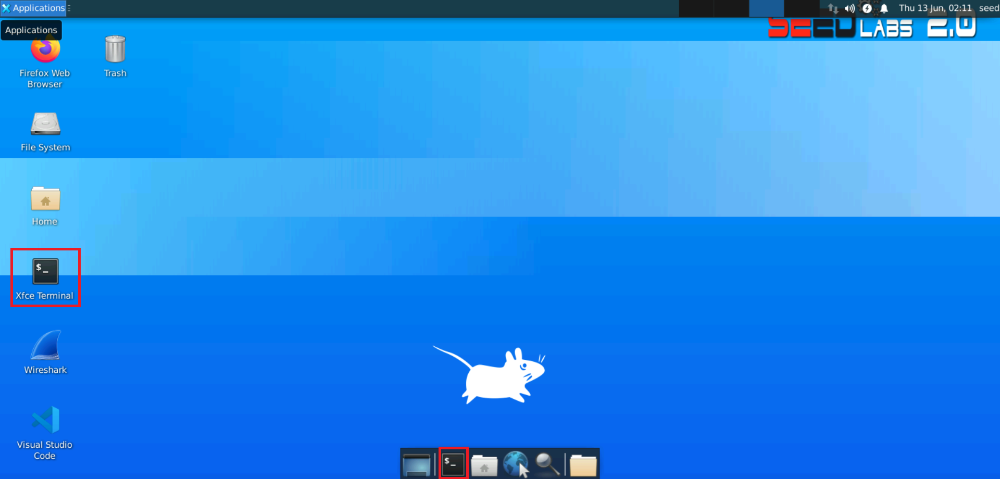
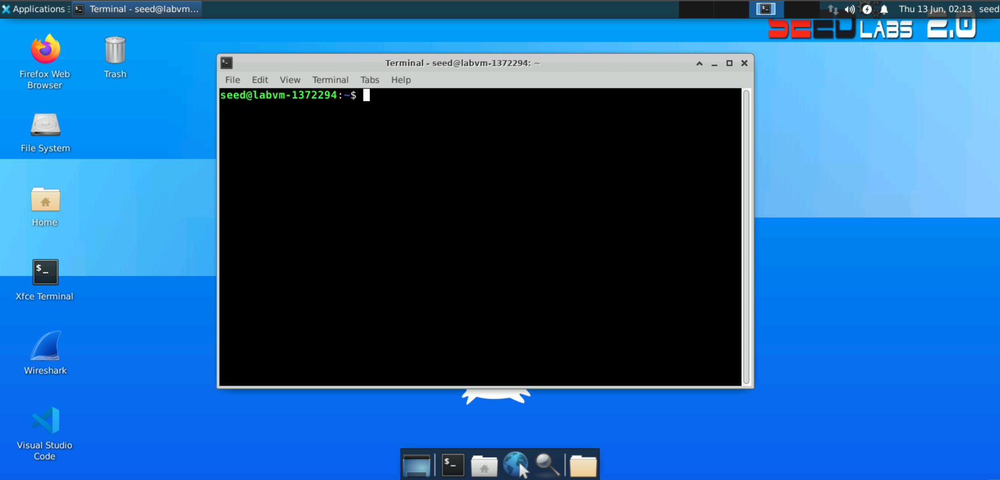

# Lab 1 - Basic Linux Commands

## Lab overview

In this lab, we are going to overview basic Linux commands for extracting information about the machine we are using, main file system operations, and basics of editing a file.

All the commands will be run using the command line interface (CLI). The CLI is a powerful tool for running applications, inspecting the system status, and configuring a machine.

1. Open a terminal application. Click on the terminal application on the desktop.



2. The terminal opens showing the shell prompt as shown below. The shell allows running commands and applications.



To run a command, type a command in the shell and press Enter. For instance, type `date` in the shell and press Enter. This runs the date command and displays the date and time of the machine.

### Run the `date` command

```bash
date
```


### 1. Finding help related to a command

For any given command, you can use the `man` command to print the command manual. For instance:

```bash
man su
```

This prints the manual for the su command. The manual usually does not fit on one screen. You have the following options:

Press `<Enter>` to scroll one line down.
Press `<Space>` to scroll one page of text down.
Press `<q>` to exit the manual.  

### 2. Running commands as a superuser

To run commands as a superuser, you need to use one of two commands.

#### 2.1 Using `su`  
`su` is a command to substitute user. It changes the user ID. If used without giving a user ID, the command changes to a superuser. After typing su and pressing Enter, the terminal asks for a password. Enter the superuser password. The prompt changes to end with # which indicates that it is running in superuser mode.

```bash
su
```

When you are done using the superuser mode, you can type `exit` to exit the superuser and return to your user mode.

```bash
exit
```

#### 2.2 Using `sudo`
`sudo` is used to run a single command in superuser mode. For instance, the following command runs `ls` in superuser mode.

```bash
sudo ls
```

### 3. Extracting Machine Information

Several common Linux commands help us extract information about the machine.

#### 3.1 Finding the OS version information
The file `/etc/os-release` contains the operating system information. We can use the `cat` command to print the file content as follows:

```bash
cat /etc/os-release
```

This output shows that the machine is running a Ubuntu OS system version 18.04.6????????????????

#### 3.2 Finding the CPU information
To find the CPU information, you can use the `lscpu` command.

```bash
lscpu
```

The output of this command shows that this machine has an intel Intel(R) Core(TM) i7-6600U CPU @ 2.60GHz CPU.???????

#### 3.3 Finding the machine IP address
To find the machine IP address, we can use the `ip` command with the `addr` option.

```bash
ip addr
```
The command prints the ip address of every interface in the system. The lo interface is a local interface an always has an ip address of 127.0.0.1. ???????????????
The command shows that this machine has the ip address of 10.0.2.15 ???????????????

### 4. Basic file system commands

The Linux files and directories are organized in a directory tree. Each directory can contain files or other directories.

#### Finding the current working directory
To find the current working directory, use the `pwd` command.

```bash
pwd
```  

#### Listing directories and files
The `ls` command lists all directories and files in the current directory.

```bash
ls
```

#### Changing a directory
To change a directory, use the `cd` command.

```bash
cd <directory_name>
```

The `cd ~` command returns the prompt to the home directory of the user.

```bash
cd ~
```

#### 4.1 Creating a directory
To create a directory, use the `mkdir` command.

```bash
mkdir newDir
```

This command creates a new directory named `newDir`.

```bash
cd newDir
```

```bash
pwd
```

`cd` will change the working directory to `newDir`. `pwd` should confirm that.

#### 4.2 Creating and reading a file
There are many commands for creating and editing a text file from within the terminal. The easiest one to learn is `nano`.

```bash
nano new_file.txt
```

This command will create a new_file.txt if it does not exist, and will open it for editing if it already exists.
The nano command opens the file for editing.

At the bottom of the nano window are the available nano commands. ^ means ctrl.
So you can write in the file something like “this is a test”
Then press <ctrl+x> to exit
When asked, press <y> to save the changes.
Press <enter> to confirm the file name.

Use ls to confirm that the new file is created.

```bash
ls
```

You can use one of the following commands to print the content of a file

```bash
more new_file.txt
```

Or 

```bash
cat new_file.txt
```

#### 4.3	Managing files

Use `cp` to copy a file.

```bash
cp new_file.txt copy_file.txt
```

To delete a file use the rm command

```bash
rm new_file.txt
```

Deletes the new_file.txt

Use `ls` to verify that the file is deleted.

