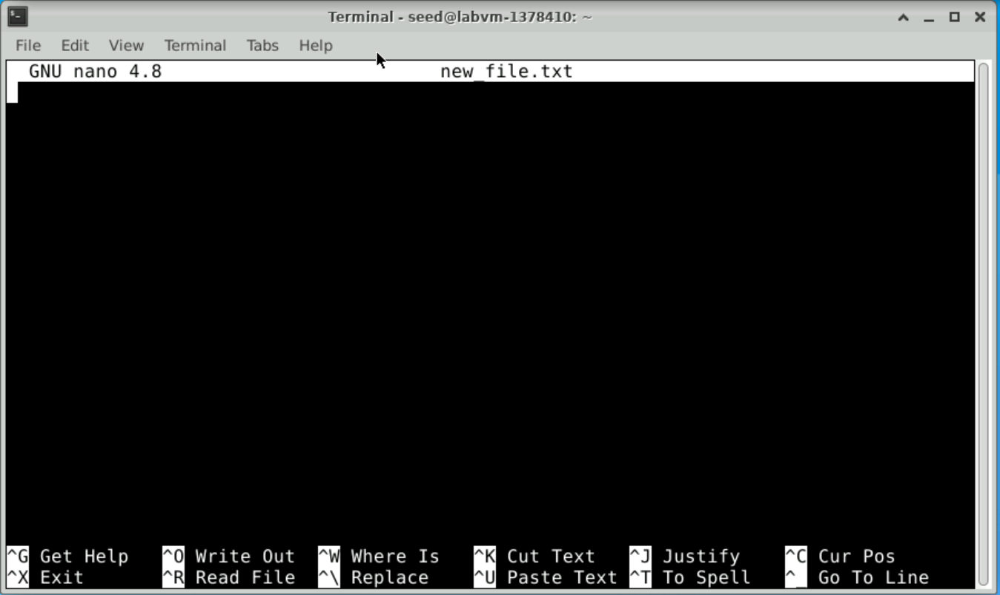

# Lab 1 - Basic Linux Commands

## Lab overview

In this lab, we are going to overview basic Linux commands for extracting information about the machine we are using, main file system operations, and basics of editing a file.

All the commands will be run using the command line interface (CLI). The CLI is a powerful tool for running applications, inspecting the system status, and configuring a machine.

1. Open a terminal application. Click on the terminal application on the desktop.


2. The terminal opens showing the shell prompt as shown below. The shell allows running commands and applications.


To run a command, type a command in the shell and press Enter. For instance, type `date` in the shell and press Enter. This runs the date command and displays the date and time of the machine.

### Run the `date` command

```bash
date
```

### Output 

```plaintext
Sat Jun 15 00:23:42 UTC 2024
```


### 1. Finding help related to a command

For any given command, you can use the `man` command to print the command manual. For instance:

```bash
man su
```

### Output 

```plaintext
SU(1)                            User Commands                           SU(1)

NAME
       su - run a command with substitute user and group ID

SYNOPSIS
       su [options] [-] [user [argument...]]

DESCRIPTION
       su allows to run commands with a substitute user and group ID.

       When  called  without  arguments, su defaults to running an interactive
       shell as root.

       For backward compatibility, su defaults to not change the  current  di‐
       rectory  and to only set the environment variables HOME and SHELL (plus
       USER and LOGNAME if the target user is not root).  It is recommended to
       always use the --login option (instead of its shortcut -) to avoid side
       effects caused by mixing environments.

       This version of su uses PAM for  authentication,  account  and  session
       management.   Some  configuration options found in other su implementa‐
       tions, such as support for a wheel group, have  to  be  configured  via
       PAM.

       su  is mostly designed for unprivileged users, the recommended solution
       for privileged users (e.g. scripts executed by root) is to use non-set-
       user-ID  command  runuser(1)  that  does not require authentication and
       provide separate PAM configuration. If the PAM session is not  required
       at all then the recommend solution is to use command setpriv(1).

OPTIONS
       -c, --command=command
              Pass command to the shell with the -c option.

       -f, --fast
              Pass  -f to the shell, which may or may not be useful, depending
              on the shell.

       -g, --group=group
              Specify the primary group.  This option is available to the root
              user only.

       -G, --supp-group=group
             Specify  a  supplemental group.  This option is available to the
              root user only.  The first specified supplementary group is also
              used as a primary group if the option --group is unspecified.

       -, -l, --login
              Start  the shell as a login shell with an environment similar to
              a real login:

                 o      clears all the environment variables except  TERM  and
                        variables specified by --whitelist-environment

                 o      initializes  the  environment  variables  HOME, SHELL,
                        USER, LOGNAME, and PATH

                 o      changes to the target user's home directory

                 o      sets argv[0] of the shell to '-' in order to make  the
                        shell a login shell

       -m, -p, --preserve-environment
              Preserve  the  entire  environment,  i.e.  it does not set HOME,
              SHELL, USER nor LOGNAME.  This option is ignored if  the  option
              --login is specified.

       -P, --pty
              Create pseudo-terminal for the session. The independent terminal
              provides better security as user does not  share  terminal  with
              the  original session.  This allow to avoid TIOCSTI ioctl termi‐
              nal injection and another security attacks against terminal file
              descriptors.  The  all session is also possible to move to back‐
              ground (e.g. "su --pty - username -c  application  &").  If  the
              pseudo-terminal  is enabled then su command works as a proxy be‐
              tween the sessions (copy stdin and stdout).

              This feature is mostly designed for interactive sessions. If the
              standard  input  is  not  a terminal, but for example pipe (e.g.
              echo "date" | su --pty) than ECHO flag for  the  pseudo-terminal
              is disabled to avoid messy output.

       -s, --shell=shell
              Run  the  specified  shell instead of the default.  The shell to
              run is selected according to the following rules, in order:

                 o      the shell specified with --shell

                 o      the shell specified in the environment variable SHELL,
                        if the --preserve-environment option is used

                 o      the  shell  listed  in  the passwd entry of the target
                        user

                 o      /bin/sh

              If the target user has a restricted shell (i.e.  not  listed  in
              /etc/shells), the --shell option and the SHELL environment vari‐
              ables are ignored unless the calling user is root.

       --session-command=command
              Same as -c but do not create a new session.  (Discouraged.)

       -w, --whitelist-environment=list
              Don't reset environment variables specified in  comma  separated
              list  when  clears environment for --login. The whitelist is ig‐
              nored for the environment variables HOME, SHELL, USER,  LOGNAME,
              and PATH.

       -V, --version
              Display version information and exit.

       -h, --help
              Display help text and exit.

SIGNALS
       Upon  receiving  either  SIGINT,  SIGQUIT or SIGTERM, su terminates its
       child and afterwards terminates itself with the received  signal.   The
       child  is  terminated by SIGTERM, after unsuccessful attempt and 2 sec‐
       onds of delay the child is killed by SIGKILL.

CONFIG FILES
       su reads the /etc/default/su and /etc/login.defs  configuration  files.
       The following configuration items are relevant for su(1):

       FAIL_DELAY (number)
           Delay  in  seconds in case of an authentication failure. The number
           must be a non-negative integer.

       ENV_PATH (string)
           Defines the PATH environment variable for a regular user.  The  de‐
           fault value is /usr/local/bin:/bin:/usr/bin.

       ENV_ROOTPATH (string)
       ENV_SUPATH (string)
           Defines  the  PATH environment variable for root.  ENV_SUPATH takes
           precedence.  The default value  is  /usr/local/sbin:/usr/local/bin:
           /sbin:/bin:/usr/sbin:/usr/bin.

       ALWAYS_SET_PATH (boolean)
           If set to yes and --login and --preserve-environment were not spec‐
           ified su initializes PATH.

       The environment variable PATH may be different on  systems  where  /bin
       and /sbin are merged into /usr.

EXIT STATUS
       su normally returns the exit status of the command it executed.  If the
       command was killed by a signal, su returns the  number  of  the  signal
       plus 128.

       Exit status generated by su itself:

                 1      Generic error before executing the requested command

                 126    The requested command could not be executed

                 127    The requested command was not found

FILES
       /etc/pam.d/su    default PAM configuration file
       /etc/pam.d/su-l  PAM configuration file if --login is specified
       /etc/default/su  command specific logindef config file
       /etc/login.defs  global logindef config file

NOTES
       For  security reasons su always logs failed log-in attempts to the btmp
       file, but it does not write to the lastlog file at all.  This  solution
       allows to control su behavior by PAM configuration.  If you want to use
       the pam_lastlog module to print warning message about failed log-in at‐
       tempts  then the pam_lastlog has to be configured to update the lastlog
       file as well. For example by:

              session  required  pam_lastlog.so nowtmp

SEE ALSO
       setpriv(1), login.defs(5), shells(5), pam(8), runuser(8)

HISTORY
       This su command was derived from coreutils' su, which was based  on  an
       implementation  by  David MacKenzie. The util-linux has been refactored
       by Karel Zak.

AVAILABILITY
       The su command is part of the util-linux package and is available  from
       Linux   Kernel   Archive  ⟨https://www.kernel.org/pub/linux/utils/util-
       linux/⟩.

util-linux                         July 2014                             SU(1)
```

This prints the manual for the su command. The manual usually does not fit on one screen. You have the following options:

Press `<Enter>` to scroll one line down.
Press `<Space>` to scroll one page of text down.
Press `<q>` to exit the manual.  

### 2. Running commands as a superuser

To run commands as a superuser, you need to use one of two commands.

#### 2.1 Using `su`  
`su` is a command to substitute user. It changes the user ID. If used without giving a user ID, the command changes to a superuser. After typing su and pressing Enter, the terminal asks for a password. Enter the superuser password. The prompt changes to end with # which indicates that it is running in superuser mode.

```bash
su
```

### Output 
```plaintext
Need password
```

When you are done using the superuser mode, you can type `exit` to exit the superuser and return to your user mode.

```bash
exit
```

#### 2.2 Using `sudo`
`sudo` is used to run a single command in superuser mode. For instance, the following command runs `ls` in superuser mode.

```bash
sudo ls
```

### Output 

```plaintext
Desktop    Downloads  Pictures	Templates  thinclient_drives
Documents  Music      Public	Videos
```

### 3. Extracting Machine Information

Several common Linux commands help us extract information about the machine.

#### 3.1 Finding the OS version information
The file `/etc/os-release` contains the operating system information. We can use the `cat` command to print the file content as follows:

```bash
cat /etc/os-release
```

### Output 

```plaintext
NAME="Ubuntu"
VERSION="20.04.6 LTS (Focal Fossa)"
ID=ubuntu
ID_LIKE=debian
PRETTY_NAME="Ubuntu 20.04.6 LTS"
VERSION_ID="20.04"
HOME_URL="https://www.ubuntu.com/"
SUPPORT_URL="https://help.ubuntu.com/"
BUG_REPORT_URL="https://bugs.launchpad.net/ubuntu/"
PRIVACY_POLICY_URL="https://www.ubuntu.com/legal/terms-and-policies/privacy-policy"
VERSION_CODENAME=focal
UBUNTU_CODENAME=focal
```

This output shows that the machine is running a Ubuntu OS system version 20.04.6

#### 3.2 Finding the CPU information
To find the CPU information, you can use the `lscpu` command.

```bash
lscpu
```

### Output 

```plaintext
Architecture:                       x86_64
CPU op-mode(s):                     32-bit, 64-bit
Byte Order:                         Little Endian
Address sizes:                      46 bits physical, 48 bits virtual
CPU(s):                             2
On-line CPU(s) list:                0,1
Thread(s) per core:                 1
Core(s) per socket:                 2
Socket(s):                          1
NUMA node(s):                       1
Vendor ID:                          GenuineIntel
CPU family:                         6
Model:                              85
Model name:                         Intel(R) Xeon(R) Platinum 8272CL CPU @ 2.60G
                                    Hz
Stepping:                           7
CPU MHz:                            2593.908
BogoMIPS:                           5187.81
Hypervisor vendor:                  Microsoft
Virtualization type:                full
L1d cache:                          64 KiB
L1i cache:                          64 KiB
L2 cache:                           2 MiB
L3 cache:                           35.8 MiB
NUMA node0 CPU(s):                  0,1
Vulnerability Gather data sampling: Unknown: Dependent on hypervisor status
Vulnerability Itlb multihit:        KVM: Mitigation: VMX unsupported
Vulnerability L1tf:                 Mitigation; PTE Inversion
Vulnerability Mds:                  Mitigation; Clear CPU buffers; SMT Host stat
                                    e unknown
Vulnerability Meltdown:             Mitigation; PTI
Vulnerability Mmio stale data:      Vulnerable: Clear CPU buffers attempted, no 
                                    microcode; SMT Host state unknown
Vulnerability Retbleed:             Vulnerable
Vulnerability Spec store bypass:    Vulnerable
Vulnerability Spectre v1:           Mitigation; usercopy/swapgs barriers and __u
                                    ser pointer sanitization
Vulnerability Spectre v2:           Mitigation; Retpolines, STIBP disabled, RSB 
                                    filling, PBRSB-eIBRS Not affected
Vulnerability Srbds:                Not affected
Vulnerability Tsx async abort:      Mitigation; Clear CPU buffers; SMT Host stat
                                    e unknown
Flags:                              fpu vme de pse tsc msr pae mce cx8 apic sep 
                                    mtrr pge mca cmov pat pse36 clflush mmx fxsr
                                     sse sse2 ss ht syscall nx pdpe1gb rdtscp lm
                                     constant_tsc rep_good nopl xtopology cpuid 
                                    pni pclmulqdq ssse3 fma cx16 pcid sse4_1 sse
                                    4_2 movbe popcnt aes xsave avx f16c rdrand h
                                    ypervisor lahf_lm abm 3dnowprefetch invpcid_
                                    single pti fsgsbase bmi1 hle avx2 smep bmi2 
                                    erms invpcid rtm avx512f avx512dq rdseed adx
                                     smap clflushopt avx512cd avx512bw avx512vl 
                                    xsaveopt xsavec xsaves md_clear
```

The output of this command shows that this machine has an intel Intel(R) Xeon(R) Platinum 8272CL CPU @ 2.60GHz

#### 3.3 Finding the machine IP address
To find the machine IP address, we can use the `ip` command with the `addr` option.

```bash
ip addr
```
#### Output

```plaintext
1: lo: <LOOPBACK,UP,LOWER_UP> mtu 65536 qdisc noqueue state UNKNOWN group default qlen 1000
    link/loopback 00:00:00:00:00:00 brd 00:00:00:00:00:00
    inet 127.0.0.1/8 scope host lo
       valid_lft forever preferred_lft forever
    inet6 ::1/128 scope host 
       valid_lft forever preferred_lft forever
2: eth0: <BROADCAST,MULTICAST,UP,LOWER_UP> mtu 1500 qdisc mq state UP group default qlen 1000
    link/ether 00:0d:3a:f4:24:fe brd ff:ff:ff:ff:ff:ff
    **inet 10.0.0.4**/24 brd 10.0.0.255 scope global eth0
       valid_lft forever preferred_lft forever
    inet6 fe80::20d:3aff:fef4:24fe/64 scope link 
       valid_lft forever preferred_lft forever
3: docker0: <NO-CARRIER,BROADCAST,MULTICAST,UP> mtu 1500 qdisc noqueue state DOWN group default 
    link/ether 02:42:71:62:d9:f4 brd ff:ff:ff:ff:ff:ff
    inet 172.17.0.1/16 brd 172.17.255.255 scope global docker0
       valid_lft forever preferred_lft forever
```
The command prints the ip address of every interface in the system. The lo interface is a local interface an always has an ip address of 127.0.0.1.
The command shows that this machine has the ip address of 10.0.0.4

### 4. Basic file system commands

The Linux files and directories are organized in a directory tree. Each directory can contain files or other directories.

#### Finding the current working directory
To find the current working directory, use the `pwd` command.

```bash
pwd
```  

### Output 

```plaintext
/home/seed
```

#### Listing directories and files
The `ls` command lists all directories and files in the current directory.

```bash
ls
```

This is an example of the list of all directories in the home directory:

### Output 
```plaintext
Desktop    Downloads  Pictures  Templates  thinclient_drives
Documents  Music      Public    Videos
```

#### Changing a directory
To change a directory, use the `cd` command followed by the directory name.

```bash
cd <directory_name>
```

The `cd ~` command returns the prompt to the home directory of the user.

```bash
cd ~
```

#### 4.1 Creating a directory
To create a directory, use the `mkdir` command.

```bash
mkdir newDir
```

You can notice that "newDir" was created 
### Output 

```plaintext
Desktop    Downloads  Pictures  Templates  newDir
Documents  Music      Public    Videos     thinclient_drives
```

This command creates a new directory named `newDir`.

```bash
cd newDir
```

```bash
pwd
```

### Output 

```plaintext
/home/seed/newDir
```

`cd` will change the working directory to `newDir`. `pwd` should confirm that.

#### 4.2 Creating and reading a file
There are many commands for creating and editing a text file from within the terminal. The easiest one to learn is `nano`.

```bash
nano new_file.txt
```

This command will create a new_file.txt if it does not exist, and will open it for editing if it already exists.
The `nano` command opens the file for editing.



At the bottom of the nano window are the available nano commands. ^ means ctrl.
So you can write in the file something like “this is a test”
Then press <ctrl+x> to exit
When asked, press <y> to save the changes.
Press <enter> to confirm the file name.

Use `ls` to confirm that the new file is created.

```bash
ls
```

### Output 

```plaintext
Desktop    Downloads  Pictures  Templates  newDir        thinclient_drives
Documents  Music      Public    Videos     new_file.txt
```

You can use one of the following commands to print the content of a file

```bash
more new_file.txt
```

Or 

```bash
cat new_file.txt
```

#### 4.3	Managing files

Use `cp` to copy a file.

```bash
cp new_file.txt copy_file.txt
```

To delete a file use the `rm` command

```bash
rm new_file.txt
```

Deletes the new_file.txt

Use `ls` to verify that the file is deleted.

