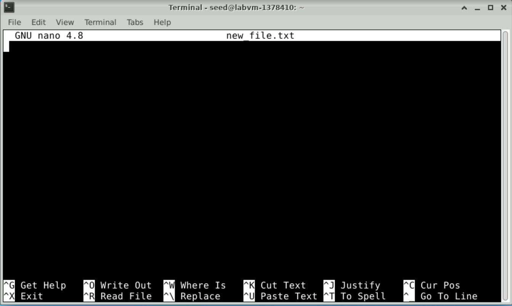

# Lab 1 - Basic Linux Commands

## Lab overview

In this lab, we are going to overview basic Linux commands for extracting information about the machine we are using, main file system operations, and basics of editing a file.

All the commands will be run using the command line interface (CLI). The CLI is a powerful tool for running applications, inspecting the system status, and configuring a machine.

## Lab Instrcutions

### Starting a shell program

1. Open a terminal application. Double click on the terminal application on the desktop.


2. The terminal opens showing the shell prompt as shown below. The shell allows running commands and applications.


To run a command, type a command in the shell and press <Enter>. For instance, type `date` in the shell and press <Enter>. This runs the date command and displays the date and time of the machine.

<!-- ### Run the `date` command -->

```bash
date
```

**Output** 

```plaintext
Sat Jun 15 00:23:42 UTC 2024
```


### 1. Finding help related to a command

For any given command, you can use the `man` command to print the command manual. For instance:

```bash
man date
```

**Output** 

```plaintext
DATE(1)                          User Commands                         DATE(1)

NAME
       date - print or set the system date and time

SYNOPSIS
       date [OPTION]... [+FORMAT]
       date [-u|--utc|--universal] [MMDDhhmm[[CC]YY][.ss]]

DESCRIPTION
       Display the current time in the given FORMAT, or set the system date.

       Mandatory  arguments  to  long  options are mandatory for short options
       too.

       -d, --date=STRING
              display time described by STRING, not 'now'

       --debug
              annotate the parsed date, and warn about questionable  usage  to
              stderr

       -f, --file=DATEFILE
              like --date; once for each line of DATEFILE

       -I[FMT], --iso-8601[=FMT]
              output  date/time  in ISO 8601 format.  FMT='date' for date only
              (the default), 'hours', 'minutes', 'seconds', or 'ns'  for  date
              and    time    to    the    indicated    precision.     Example:
              2006-08-14T02:34:56-06:00

       -R, --rfc-email
              output date and time in RFC 5322 format.  Example: Mon,  14  Aug
              2006 02:34:56 -0600

       --rfc-3339=FMT
              output  date/time in RFC 3339 format.  FMT='date', 'seconds', or
              'ns' for date and time to  the  indicated  precision.   Example:
              2006-08-14 02:34:56-06:00

       -r, --reference=FILE
              display the last modification time of FILE

       -s, --set=STRING
              set time described by STRING

       -u, --utc, --universal
              print or set Coordinated Universal Time (UTC)

       --help display this help and exit

       --version
              output version information and exit

       FORMAT controls the output.  Interpreted sequences are:

       %%     a literal %

       %a     locale's abbreviated weekday name (e.g., Sun)

       %A     locale's full weekday name (e.g., Sunday)

       %b     locale's abbreviated month name (e.g., Jan)

       %B     locale's full month name (e.g., January)

       %c     locale's date and time (e.g., Thu Mar  3 23:05:25 2005)

       %C     century; like %Y, except omit last two digits (e.g., 20)

       %d     day of month (e.g., 01)

       %D     date; same as %m/%d/%y

       %e     day of month, space padded; same as %_d

       %F     full date; same as %Y-%m-%d

       %g     last two digits of year of ISO week number (see %G)

       %G     year of ISO week number (see %V); normally useful only with %V

       %h     same as %b

       %H     hour (00..23)

       %I     hour (01..12)

       %j     day of year (001..366)

       %k     hour, space padded ( 0..23); same as %_H

       %l     hour, space padded ( 1..12); same as %_I

       %m     month (01..12)

       %M     minute (00..59)

       %n     a newline

       %N     nanoseconds (000000000..999999999)

       %p     locale's equivalent of either AM or PM; blank if not known

       %P     like %p, but lower case

       %q     quarter of year (1..4)

       %r     locale's 12-hour clock time (e.g., 11:11:04 PM)

       %R     24-hour hour and minute; same as %H:%M

       %s     seconds since 1970-01-01 00:00:00 UTC

       %S     second (00..60)

       %t     a tab

       %T     time; same as %H:%M:%S

       %u     day of week (1..7); 1 is Monday

       %U     week number of year, with Sunday as first day of week (00..53)

       %V     ISO week number, with Monday as first day of week (01..53)

       %w     day of week (0..6); 0 is Sunday

       %W     week number of year, with Monday as first day of week (00..53)

       %x     locale's date representation (e.g., 12/31/99)

       %X     locale's time representation (e.g., 23:13:48)

       %y     last two digits of year (00..99)

       %Y     year

       %z     +hhmm numeric time zone (e.g., -0400)

       %:z    +hh:mm numeric time zone (e.g., -04:00)

       %::z   +hh:mm:ss numeric time zone (e.g., -04:00:00)

       %:::z  numeric  time  zone  with  :  to necessary precision (e.g., -04,
              +05:30)

       %Z     alphabetic time zone abbreviation (e.g., EDT)

       By default, date pads numeric fields with zeroes.   The  following  op‐
       tional flags may follow '%':

       -      (hyphen) do not pad the field

       _      (underscore) pad with spaces

       0      (zero) pad with zeros

       ^      use upper case if possible

       #      use opposite case if possible

       After  any  flags  comes  an optional field width, as a decimal number;
       then an optional modifier, which is either E to use the locale's alter‐
       nate  representations  if available, or O to use the locale's alternate
       numeric symbols if available.

EXAMPLES
       Convert seconds since the epoch (1970-01-01 UTC) to a date

              $ date --date='@2147483647'

       Show the time on the west coast of the US (use tzselect(1) to find TZ)

              $ TZ='America/Los_Angeles' date

       Show the local time for 9AM next Friday on the west coast of the US

              $ date --date='TZ="America/Los_Angeles" 09:00 next Fri'

DATE STRING
       The --date=STRING is a mostly free format human  readable  date  string
       such  as  "Sun, 29 Feb 2004 16:21:42 -0800" or "2004-02-29 16:21:42" or
       even "next Thursday".  A date string may contain items indicating  cal‐
       endar  date,  time of day, time zone, day of week, relative time, rela‐
       tive date, and numbers.  An empty string indicates the beginning of the
       day.   The date string format is more complex than is easily documented
       here but is fully described in the info documentation.

AUTHOR
       Written by David MacKenzie.

REPORTING BUGS
       GNU coreutils online help: <https://www.gnu.org/software/coreutils/>
       Report date translation bugs to <https://translationproject.org/team/>

COPYRIGHT
       Copyright © 2018 Free Software Foundation, Inc.   License  GPLv3+:  GNU
       GPL version 3 or later <https://gnu.org/licenses/gpl.html>.
       This  is  free  software:  you  are free to change and redistribute it.
       There is NO WARRANTY, to the extent permitted by law.

SEE ALSO
       Full documentation at: <https://www.gnu.org/software/coreutils/date>
       or available locally via: info '(coreutils) date invocation'

GNU coreutils 8.30              September 2019                         DATE(1)
```

This prints the manual for the date command. The manual usually does not fit on one screen. You have the following options:

+ Press `<Enter>` to scroll one line down.
+ Press `<Space>` to scroll one page of text down.
+ Press `<q>` to exit the manual.  

### 2. Running commands as a superuser

<!---
#### 2.1 Using `su`  
`su` is a command to substitute user. It changes the user ID. If used without giving a user ID, the command changes to a superuser. After typing su and pressing Enter, the terminal asks for a password. Enter the superuser password. The prompt changes to end with # which indicates that it is running in superuser mode.

```bash
su
```

**Output** 

```plaintext
root@labvm-1378410:/home/seed#
```

When you are done using the superuser mode, you can type `exit` to exit the superuser and return to your user mode.

```bash
exit
```

**Output** 
```plaintext
exit
seed@labvm-1378410:~$
```

#### 2.2 Using `sudo`
--->

To run commands as a superuser, you need to use `sudo`. The `sudo` command allows you to execute a single command with superuser (root) privileges. This is useful for performing administrative tasks that require higher permissions than those of a regular user.

For instance, the following command runs `ls` (which lists directory contents) with superuser mode:

```bash
sudo ls
```

**Output** 

```plaintext
Desktop    Downloads  Pictures	Templates  thinclient_drives
Documents  Music      Public	Videos
```

> [!CAUTION]
> Using <sudo> runs commands in superuser mode which allows the command that is executed in this mode to change critical configurations and files in the operating system.
> Consequantly, best practice for using superuser mode is:
> + Limit the use of the superuser mode to the bare minimum commands that need superuser priviligaes
> + Only run commands that you trust and know what they do exactly

### 3. Extracting Machine Information

Several common Linux commands help us extract information about the machine.

#### 3.1 Finding the OS version information
The file `/etc/os-release` contains the operating system information. We can use the `cat` command to print the file content as follows:

```bash
cat /etc/os-release
```

**Output** 

```plaintext
NAME="Ubuntu"
VERSION="20.04.6 LTS (Focal Fossa)"
ID=ubuntu
ID_LIKE=debian
PRETTY_NAME="Ubuntu 20.04.6 LTS"
VERSION_ID="20.04"
HOME_URL="https://www.ubuntu.com/"
SUPPORT_URL="https://help.ubuntu.com/"
BUG_REPORT_URL="https://bugs.launchpad.net/ubuntu/"
PRIVACY_POLICY_URL="https://www.ubuntu.com/legal/terms-and-policies/privacy-policy"
VERSION_CODENAME=focal
UBUNTU_CODENAME=focal
```

This output shows that the machine is running a Ubuntu OS system version 20.04.6

#### 3.2 Finding the CPU information
To find the CPU information, you can use the `lscpu` command.

```bash
lscpu
```

**Output** 

```plaintext
Architecture:                       x86_64
CPU op-mode(s):                     32-bit, 64-bit
Byte Order:                         Little Endian
Address sizes:                      46 bits physical, 48 bits virtual
CPU(s):                             2
On-line CPU(s) list:                0,1
Thread(s) per core:                 1
Core(s) per socket:                 2
Socket(s):                          1
NUMA node(s):                       1
Vendor ID:                          GenuineIntel
CPU family:                         6
Model:                              85
Model name:                         Intel(R) Xeon(R) Platinum 8272CL CPU @ 2.60G
                                    Hz
Stepping:                           7
CPU MHz:                            2593.908
BogoMIPS:                           5187.81
Hypervisor vendor:                  Microsoft
Virtualization type:                full
L1d cache:                          64 KiB
L1i cache:                          64 KiB
L2 cache:                           2 MiB
L3 cache:                           35.8 MiB
NUMA node0 CPU(s):                  0,1
Vulnerability Gather data sampling: Unknown: Dependent on hypervisor status
Vulnerability Itlb multihit:        KVM: Mitigation: VMX unsupported
Vulnerability L1tf:                 Mitigation; PTE Inversion
Vulnerability Mds:                  Mitigation; Clear CPU buffers; SMT Host stat
                                    e unknown
Vulnerability Meltdown:             Mitigation; PTI
Vulnerability Mmio stale data:      Vulnerable: Clear CPU buffers attempted, no 
                                    microcode; SMT Host state unknown
Vulnerability Retbleed:             Vulnerable
Vulnerability Spec store bypass:    Vulnerable
Vulnerability Spectre v1:           Mitigation; usercopy/swapgs barriers and __u
                                    ser pointer sanitization
Vulnerability Spectre v2:           Mitigation; Retpolines, STIBP disabled, RSB 
                                    filling, PBRSB-eIBRS Not affected
Vulnerability Srbds:                Not affected
Vulnerability Tsx async abort:      Mitigation; Clear CPU buffers; SMT Host stat
                                    e unknown
Flags:                              fpu vme de pse tsc msr pae mce cx8 apic sep 
                                    mtrr pge mca cmov pat pse36 clflush mmx fxsr
                                     sse sse2 ss ht syscall nx pdpe1gb rdtscp lm
                                     constant_tsc rep_good nopl xtopology cpuid 
                                    pni pclmulqdq ssse3 fma cx16 pcid sse4_1 sse
                                    4_2 movbe popcnt aes xsave avx f16c rdrand h
                                    ypervisor lahf_lm abm 3dnowprefetch invpcid_
                                    single pti fsgsbase bmi1 hle avx2 smep bmi2 
                                    erms invpcid rtm avx512f avx512dq rdseed adx
                                     smap clflushopt avx512cd avx512bw avx512vl 
                                    xsaveopt xsavec xsaves md_clear
```

The output of this command shows that this machine has an intel Intel(R) Xeon(R) Platinum 8272CL CPU @ 2.60GHz

#### 3.3 Finding the machine IP address
To find the machine IP address, we can use the `ip` command with the `addr` option.

```bash
ip addr
```
**Output**

```plaintext
1: lo: <LOOPBACK,UP,LOWER_UP> mtu 65536 qdisc noqueue state UNKNOWN group default qlen 1000
    link/loopback 00:00:00:00:00:00 brd 00:00:00:00:00:00
    inet 127.0.0.1/8 scope host lo
       valid_lft forever preferred_lft forever
    inet6 ::1/128 scope host 
       valid_lft forever preferred_lft forever
2: eth0: <BROADCAST,MULTICAST,UP,LOWER_UP> mtu 1500 qdisc mq state UP group default qlen 1000
    link/ether 00:0d:3a:f4:24:fe brd ff:ff:ff:ff:ff:ff
    **inet 10.0.0.4**/24 brd 10.0.0.255 scope global eth0
       valid_lft forever preferred_lft forever
    inet6 fe80::20d:3aff:fef4:24fe/64 scope link 
       valid_lft forever preferred_lft forever
3: docker0: <NO-CARRIER,BROADCAST,MULTICAST,UP> mtu 1500 qdisc noqueue state DOWN group default 
    link/ether 02:42:71:62:d9:f4 brd ff:ff:ff:ff:ff:ff
    inet 172.17.0.1/16 brd 172.17.255.255 scope global docker0
       valid_lft forever preferred_lft forever
```
The command prints the ip address of every interface in the system. The lo interface is a local interface and always has an ip address of 127.0.0.1.
The command shows that this machine has the ip address of 10.0.0.4

### 4. Basic file system commands

The Linux files and directories are organized in a directory tree. Each directory can contain files or other directories.

#### Finding the current working directory
To find the current working directory, use the `pwd` command.

```bash
pwd
```  

**Output** 

```plaintext
/home/seed
```

#### Listing directories and files
The `ls` command lists all directories and files in the current directory.

```bash
ls
```

This is an example of the list of all directories in the home directory:

**Output** 
```plaintext
Desktop    Downloads  Pictures  Templates  thinclient_drives
Documents  Music      Public    Videos
```

#### Changing a directory
To change a directory, use the `cd` command followed by the directory name.

```bash
cd <directory_name>
```

The `cd ~` command returns the prompt to the home directory of the user.

```bash
cd ~
```

#### 4.1 Creating a directory
To create a directory, use the `mkdir` command.

```bash
mkdir newDir
```

You can notice that "newDir" was created by running the <ls> command

```bash
ls
```

**Output** 

```plaintext
Desktop    Downloads  Pictures  Templates  newDir
Documents  Music      Public    Videos     thinclient_drives
```

This command creates a new directory named `newDir`. You can change to the <newDir>

```bash
cd newDir
```

```bash
pwd
```

**Output** 

```plaintext
/home/seed/newDir
```

`cd` will change the working directory to `newDir`. `pwd` should confirm that.

#### 4.2 Creating and reading a file
There are many commands for creating and editing a text file from within the terminal. The easiest one to learn is `nano`.

```bash
nano new_file.txt
```

This command will create a new_file.txt if it does not exist, and will open it for editing if it already exists.
The `nano` command opens the file for editing.



At the bottom of the nano window are the available nano commands. ^ means ctrl.
So you can write in the file something like “this is a test”
Then press <ctrl+x> to exit
When asked, press <y> to save the changes.
Press <enter> to confirm the file name.

Use `ls` to confirm that the new file is created.

```bash
ls
```

**Output** 

```plaintext
Desktop    Downloads  Pictures  Templates  newDir        thinclient_drives
Documents  Music      Public    Videos     new_file.txt
```

You can use one of the following commands to print the content of a file

```bash
more new_file.txt
```

Or 

```bash
cat new_file.txt
```

**Output** 

```plaintext
This is the content of new_file.txt
```

#### 4.3	Managing files

Use `cp` to copy a file.

```bash
cp new_file.txt copy_file.txt
```
This command copies the file <new_file.txt> to a new file <copy_file.txt>

**Output** 

```plaintext
Desktop    Downloads  Pictures  Templates  copy_file.txt  new_file.txt
Documents  Music      Public    Videos     newDir         thinclient_drives
```

You can see that you have two files now: new_file.txt and copy_file.txt

To delete a file use the `rm` command

```bash
rm new_file.txt
```

Deletes the new_file.txt

Use `ls` to verify that the file is deleted.

**Output** 

```plaintext
Desktop    Downloads  Pictures  Templates  copy_file.txt  thinclient_drives
Documents  Music      Public    Videos     newDir
```

### You succefuly completed the Lab
