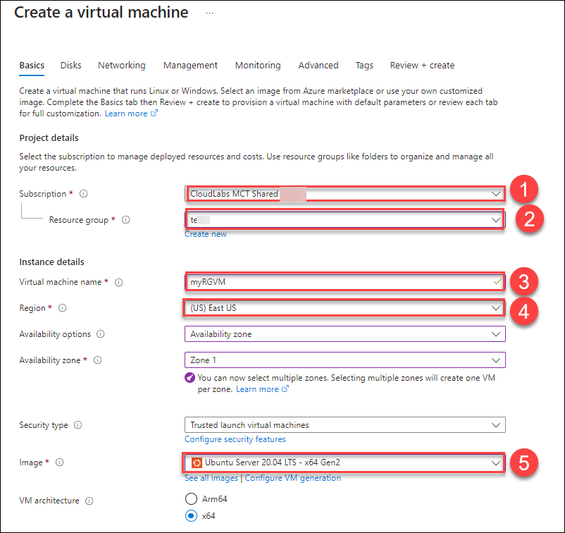
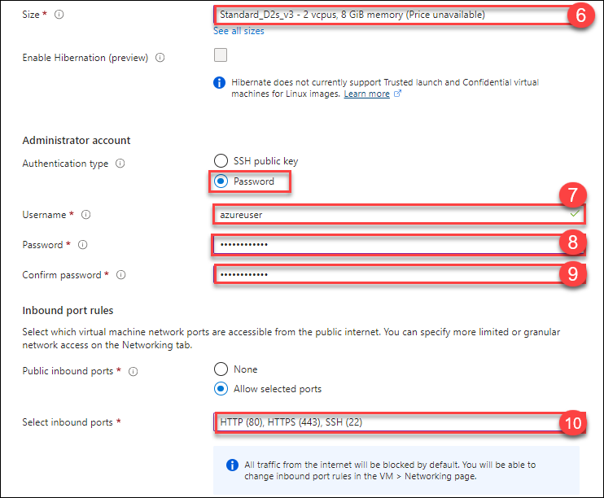
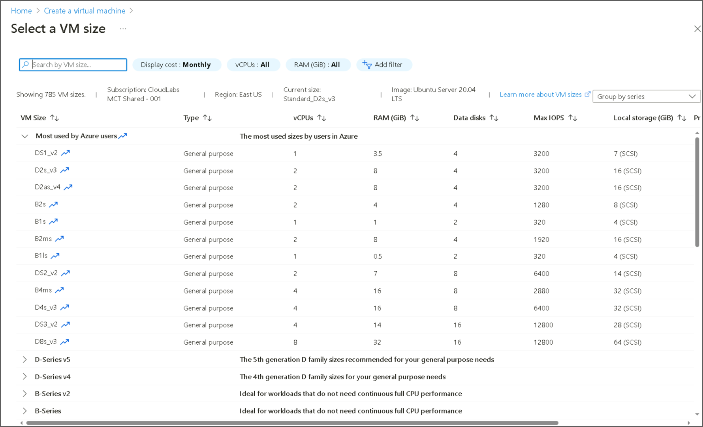
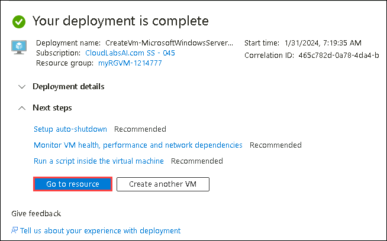
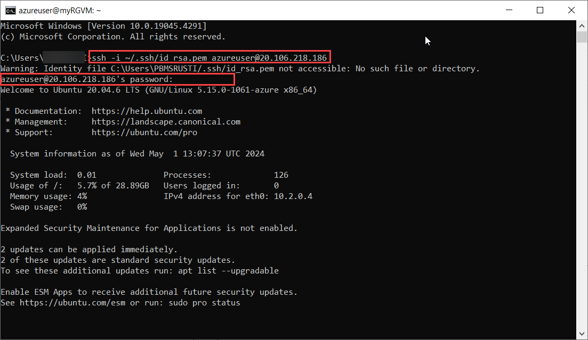
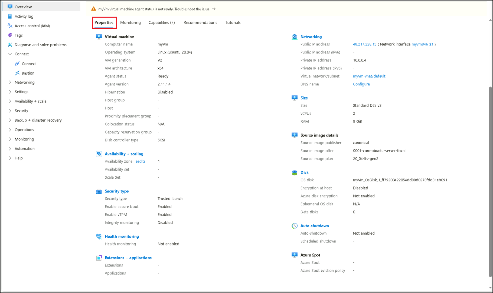

# Lab 2 - Create a Linux virtual machine in the portal

## Lab overview

An Azure Virtual Machine (VM) is a computing resource provided by Microsoft Azure. It allows users to create and use virtualized computing instances in the cloud. Azure Virtual Machines enable users to run applications, host websites, and perform various computing tasks without needing to purchase and maintain physical hardware.

In this walkthrough, we will create a Linux virtual machine in the Azure portal, connect to the virtual machine, install the Apache web server and test.

## Lab objectives

In this lab, you will complete the following tasks:

+ Task 1: Create the Linux virtual machine
+ Task 2: Connect to the virtual machine
+ Task 3: Install Apache server and access

## Estimated timing: 30 minutes

### Task 1: Create the virtual machine

In this task, we will create a **Ubuntu Server 20.04 LTS** virtual machine. 

1. On Azure Portal page, in Search resources, services and docs (G+/) box at the top of the portal, enter **Virtual machines (1)**, and then select **Virtual machines (2)** under services.

    

1. On the **Virtual machines** blade, click **+ Create (1)** and choose **Azure virtual machine (2)**.

     

1. On the **Basics** tab, fill in the following information (leave the defaults for everything else):

    | Settings | Values |
    |  -- | -- |
    | Subscription | **Accept default subscription** (1)|
    | Resource group | **myRGVM-<inject key="DeploymentID" enableCopy="false"/>** (2) |
    | Virtual machine name | **myVm** (3)|
    | Location | **(US) East US** (4)|
    | Image | **Ubuntu Server 20.04 LTS** (5)|
    | Size | **Standard_D2s_v3** (6)|
    | Authentication type| **Password** |
    | Administrator account username | **azureuser** (7)|
    | Administrator account password | **Pa$$w0rd1234** (8)|
    | Inbound port rules  | **Allow select ports** (9)|
    | Select inbound ports | **SSH (22)** and **HTTP (80)** and **HTTPS** (443) (10)|
    |||
   
    
   
    

   Here, you chose the size

   
   
   


1. Click **Next** to switch to the **Disks** tab and in the **OS Disk type** select **Standard HDD** from the dropdown and leave everything else as default and click **Next**. 

   

1. Within the Networking tab, look for the **Select inbound ports**:

    | Settings | Values |
    | -- | -- |
    | Select inbound ports | **HTTP (80), SSH (22)** and **HTTPS** (443)|
   
    >**Note:** - Verify that ports 80, 443 and 22 are selected

1. Click **Next** to switch to the **Management** tab and leave everything as default.

1. Click **Next** to switch to the **Monitoring** tab, select the following setting:

    | Settings | Values |
    | -- | -- |
    | Boot diagnostics | **Disable**|
  
1. Leave the remaining defaults and then click the **Review + Create** button at the bottom of the page.

1. Once Validation is passed click the **Create** button. It can take anywhere from five to seven minutes to deploy the virtual machine.

1. You will receive updates on the deployment page and via the **Notifications** area (the bell icon in the top menu).

   >**Note**: Here is the reference link for virtual machine https://azure.microsoft.com/en-in/resources/cloud-computing-dictionary/what-is-a-virtual-machine/

### Task 2: Connect to the virtual machine

In this task, we will connect to our new virtual machine using RDP. 

1. Once the deployment is complete, click on **Go to resource** you will be directed to the page of the newly created Virtual Machine.

    
   
1. On the virtual machine **Overview** blade, click the **Connect** button and choose the **Connect** from the dropdown.

    

    >**Note:**: The following directions tell you how to connect to your VM from a Windows computer.

1. Within the **Connect** page, click on **Select** under **Native SSH**.

   

1. Check the terms and conditions and click on **Configure**, Copy the SSH command

    

1. Next, open **Command Prompt** and paste the copied SSH command from previous step.
   
1. Provide the password(Pa$$w0rd1234) when prompted and click Enter. 

    

### Task 3:  Install Apache server and access on your New Azure Cloud VM

In this task, install the Apache Web Server and access it.

1. Within the Linux (Ubuntu) VM , run the command
   ```
   sudo apt install apache2
   ```   
1. Open a new browser tab, paste the public IP address into the URL text box, and press the Enter key to browse to it. The custom created basic website shows up.

    

   
    >**Congratulations** on completing the task!
    
#### Overview of the Virtual Machine 
In this section, you will get an overview of the Virtual Machine (VM). Below, you can see the "Essential" section, which repeats the configuration details of your VM.

 

Additionally, you can use these buttons to manage your VM, including options to Stop, Restart, Capture, and Delete the machine.

 

Moreover, by scrolling down, you can explore several tabs that provide detailed information and controls for your virtual machine (VM).

- Properties: Displays the properties of the machine.

 

- Monitoring: Offers comprehensive information, including performance metrics and availability, for example CPU usage, which displays the current CPU usage of the virtual machine (VM); and disk usage, which shows the current disk usage of the VM.

 

#### Setup A Cost Alert
Manage how mony you spent, fill write a name for a budghet (like $500), 
- Steps: budget name:
    
### Review

In this lab, you have completed:
- Create the virtual machine
- Connect to the virtual machine
-  Install Apache server and access

## Reference links

- https://azure.microsoft.com/en-in/resources/cloud-computing-dictionary/what-is-a-virtual-machine/

- https://learn.microsoft.com/en-us/partner-center/marketplace/azure-vm-use-approved-base

## You have successfully completed this lab.
