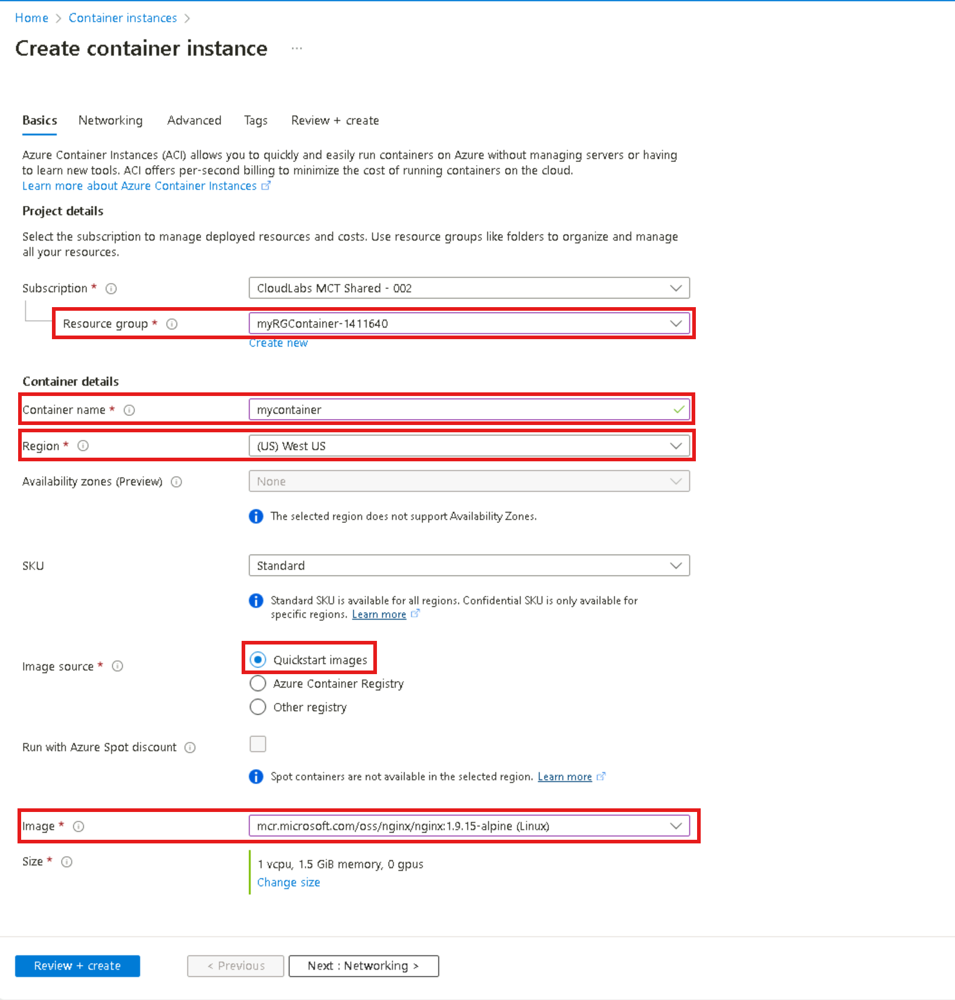
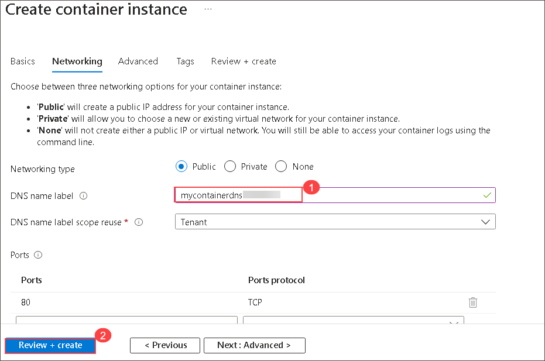
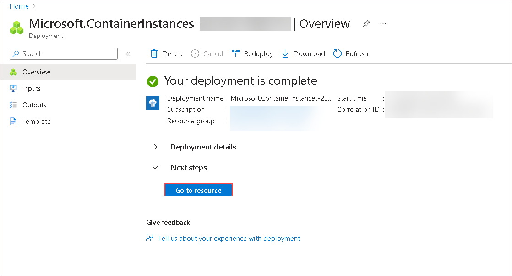

## Lab overview

Azure Container Instances enables exposing your container groups directly to the internet with an IP address and a fully qualified domain name (FQDN). When you create a container instance, you can specify a custom DNS name label so your application is reachable. Azure Container Instances offers the fastest and simplest way to run a container in Azure, without having to manage any virtual machines and without having to adopt a higher-level service.

In this walkthrough, we create, configure, and deploy a Docker container by using Azure Container Instances (ACI) in the Azure Portal. The container is a Welcome to ACI web application that displays a static HTML page.

## Lab objectives

In this lab, you will complete the following tasks:

+ Task 1: Create a container instance
+ Task 2: Verify deployment of the container instance

## Estimated timing: 15 minutes

## Architecture diagram

 

### Task 1: Create Azure Container Instances (ACI) and Deploying a Web Server (Nginx) on it.

In this task, we will create a new container instance and deploying a web server (Nginx) on it. 

1. On Azure Portal page, in **Search resources, services and docs (G+/)** box at the top of the portal, enter **Container instances (1)**, and then select **Container instances (2)** under services.

   
   
1. On **Container instances** blade, click **+ Create**. 

1. On the **basics** tab. Provide the following basic details for creating a new container instance then click **Next : Networking >**.
1. Using Pre-defined images: There are prebuilt container images provided by Azure. They are ready-to-use images that you can select when creating a container instance without needing to build or customize the image yourself.
2. Next, Select Nginx or any other desired image from the list provided.

	| Setting| Value|
	|----|----|
	| Subscription | **Choose your subscription** |
	| Resource group | **myRGContainer-<inject key="DeploymentID" enableCopy="false" />** |
	| Container name| **mycontainer**|
	| Region | **<inject key="Region" enableCopy="false"/>** |
	| Image source| **Quickstart images**|
	| Image| **mcr.microsoft.com/oss/nginx/nginx:1.9.15-alpine (Linux)**|
	| Size| ***Leave at the default***|

  
  
  
1. On **Networking** tab . Specify the following and leave all other settings at their default values and click **Review + create (2)**.

    | Setting| Value|
    |--|--|
    | DNS name label| **mycontainerdns<inject key="DeploymentID" enableCopy="false" /> (1)** |
    |||

    
   
	>**Note**: Your container will be publicly reachable at dns-name-label.region.azurecontainer.io. If you receive a **DNS name label not available** error message following the deployment.

1. Click **Create** to create the container instance. 

1. Monitor the deployment page and the **Notifications** page. 

1. While you wait you may be interested in viewing the [sample code behind this simple application](https://github.com/Azure-Samples/aci-helloworld). Browse the \app folder. 

### Task 2: Verify deployment of the container instance

In this task, we verify that the container instance is running by ensuring that the welcome page displays.

1. After the deployment is complete, click the **Go to resource** button.

   

1. On the **Overview** blade of **mycontainer**, ensure your container **Status** is **Running**.

    

1. Locate and copy the **Fully Qualified Domain Name (FQDN)**.

    

1. Paste the container's FQDN into the new browser tab and press **Enter**. The Welcome page should display.

   >**Note**: It might take 3 - 5 minutes to load the page.
 
   
	
   >**Note**: You could also use the container IP address in your browser.

<validation step="f87beab3-3bb6-467e-839f-c821f172a4b8" />
   
> **Congratulations** on completing the task! Now, it's time to validate it. Here are the steps:
> - If you receive a success message, you can proceed to the next task.
> - If not, carefully read the error message and retry the step, following the instructions in the lab guide. 
> - If you need any assistance, please contact us at labs-support@spektrasystems.com. We are available 24/7 to help you out.
    
### Review
In this lab, you have completed:
- Created a container instance
- Verified deployment of the container instance

## Reference links

- https://learn.microsoft.com/en-us/azure/container-instances/container-instances-overview

- https://learn.microsoft.com/en-us/azure/container-instances/container-instances-quickstart-portal
  
## You have successfully completed this lab.

