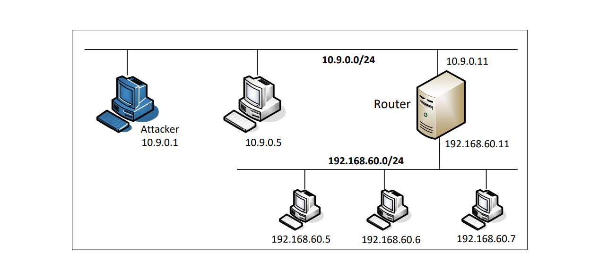
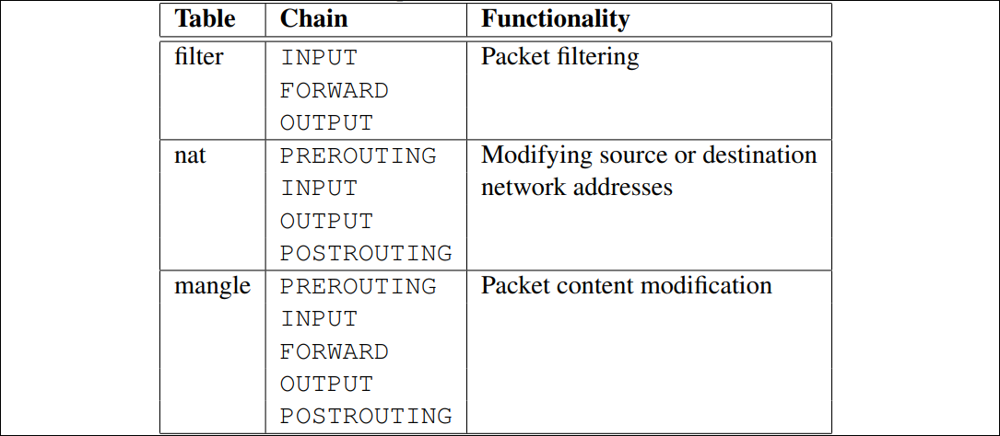
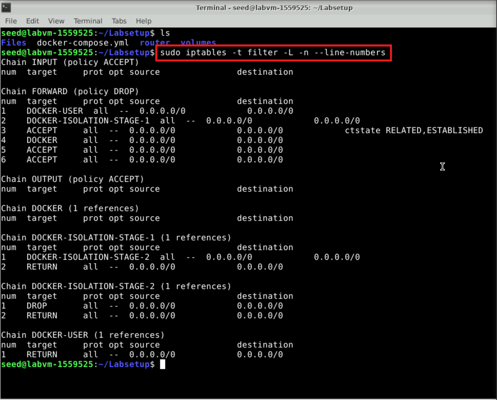
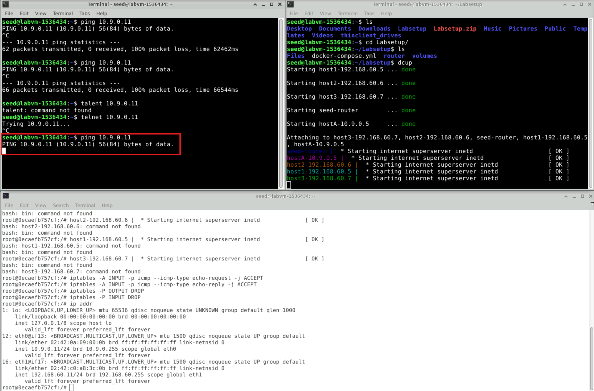
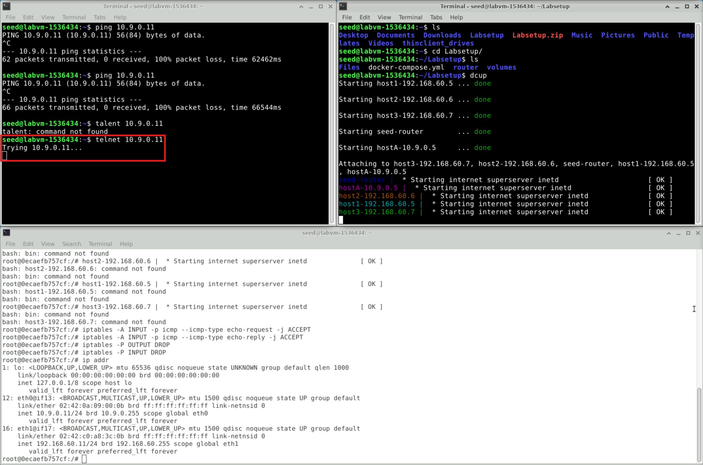
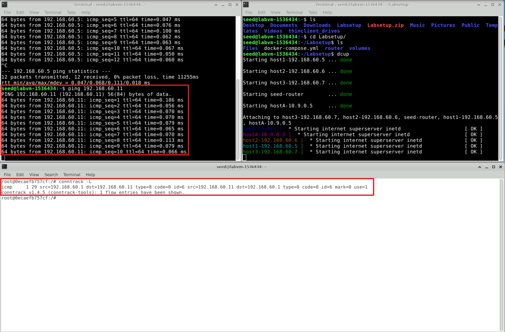
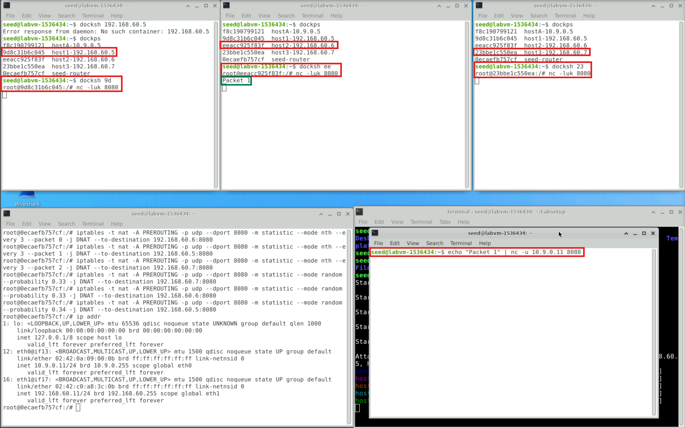

# Lab 6: Firewall Exploration Lab

```
Copyright © 2006 - 2021 by Wenliang Du.
This work is licensed under a Creative Commons Attribution-NonCommercial-ShareAlike 4.0 International License. If you remix, transform, or build upon the material, this copyright notice must be left intact, or reproduced in a way that is reasonable to the medium in which the work is being re-published.
```

## 1. Overview
Linux has a built-in firewall is called `iptables`. In this lab, students will be given a simple network topology, and are asked to use `iptables` to set up firewall rules to protect the network. Students will also be exposed to several other interesting applications of `iptables`. This lab covers the following topics:

- Using `iptables` to set up firewall rules
- Various applications of `iptables`

## 2. Lab Environment

### Step 1: Download and Extract the Lab Files
Download Labsetup.zip from the lab’s website and unzip it. This will provide you with the necessary files, including the docker-compose.yml for setting up the lab environment.

```
# Download the lab setup files
$ sudo wget https://seedsecuritylabs.org/Labs_20.04/Files/Firewall/Labsetup.zip

# Unzip the lab setup files
$ sudo unzip Labsetup.zip
```

### Step 2: Navigate to the Lab Setup Directory
Move into the extracted Labsetup folder, where you will find the docker-compose.yml file and other necessary files. Figure 1 shows the lab setup.


&emsp; &emsp; &emsp; &emsp; &emsp; &emsp; &emsp; &emsp; &emsp; &emsp; &emsp; Figure 1: Firewall Lab setup.

<Br>
&emsp; 

```
# Enter the Labsetup folder
$ cd Labsetup
```

### Step 3: Build the Docker Container
Use Docker Compose to build the container image. This step prepares the environment for running your web server with the required configurations.

```
# Build the Docker container
$ docker-compose build

# OR use the alias
$ dcbuild
```

### Step 4: Start the Docker Container
This command initializes and runs the container based on the configurations specified in the docker-compose.yml file.

```
# Start the Docker container
$ docker-compose up

# OR use the alias
$ dcup
```

### Step 5: Stop and Shut Down the Docker Container
When you’re finished or need to reset the environment, shut down the running container to release resources.

```
# Stop and shut down the Docker container
$ docker-compose down

# OR use the alias
$ dcdown
```
 
All the containers will be running in the background. To run commands on a container, we often need
to get a shell on that container. We first need to use the `"docker ps"` command to find out the ID of
the container, and then use `"docker exec"` to start a shell on that container. We have created aliases for
them in the `.bashrc` file.

#### 1. List Running Docker Containers
Use the alias dockps to view a list of running containers, displaying each container's ID and name in a simplified format.

```
$ dockps
```

#### Output
The output will list all running Docker containers, each with its unique ID and assigned name. An example output might look like this:

```
b1004832e275 hostA-10.9.0.5
0af4ea7a3e2e hostB-10.9.0.6
9652715c8e0a hostC-10.9.0.7
```
Each line includes the container ID and its corresponding name (in this case, hostA, hostB, and hostC), along with their assigned IP addresses.

#### 2. Access a Specific Container’s Shell
To open a shell inside a specific container, use the alias docksh followed by the first few characters of the container's ID. For example, to access hostC, use the ID prefix 96 (from the third line in the previous output).

```
$ docksh 96
```

#### Output
You will be logged into a shell session inside the specified container. The prompt will change to show the container ID, indicating that you are now inside the container:

```
root@9652715c8e0a:/#
```

#### Note: If a Docker command requires the container ID, you only need to type the first few characters, as long as they are unique among all running containers.

## 3. Task 1: Experimenting with Stateless Firewall Rules

`Linux` already has a built-in firewall is called `iptables`. Technically, the kernel part implementation of the firewall is called `Xtables`, while `iptables` is a user-space program to configure the firewall. However,`iptables` is often used to refer to both the kernel-part implementation
and the user-space program.

### 3.1 Background of iptables

In this task, we will use `iptables` to set up a firewall. The` iptables` firewall is designed not only to filter packets, but also to make changes to packets. To help manage these firewall rules for different purposes, `iptables` organizes all rules using a hierarchical structure: table, chain, and rules. There are several tables, each specifying the main purpose of the rules as shown in Table 1. For example, rules for
packet filtering should be placed in the `filter` table, while rules for making changes to packets should be placed in the `nat` or `mangle` tables.
<Br>
&emsp; Each table contains several chains, each of which corresponds to a `netfilter` hook. Basically, each chain indicates where its rules are enforced. For example, rules on the `FORWARD` chain are enforced at the `NF_INET_FORWARD` hook, and rules on the `INPUT` chain are enforced at the `NF_INET_LOCALIN` hook.
<Br>
&emsp; Each chain contains a set of firewall rules that will be enforced. When we set up firewalls, we add rules to these chains. For example, if we would like to block all incoming `telnet` traffic, we would add a rule to the `INPUT` chain of the `filter` table. If we would like to redirect all incoming `telnet` traffic to a different port on a different host, basically doing port forwarding, we can add a rule to the `INPUT` chain of the `mangle` table, as we need to make changes to packets.

### 3.2 Using iptables

To add rules to the chains in each table, we use the `iptables` command, which is a quite powerful command. Students can find the manual of `iptables` by typing "`man iptables`" or easily find many tutorials from online. What makes `iptables` complicated is the many command-line arguments that we need to provide when using the command. However, if we understand the structure of these command-line arguments, we will find out that the command is not that complicated.
<Br>
&emsp; In a typical `iptables` command, we add a rule to or remove a rule from one of the chains in one of the tables, so we need to specify a table name (the default is `filter`), a chain name, and an operation on the chain. After that, we specify the rule, which is basically a pattern that will be matched with each of the packets passing through. If there is a match, an action will be performed on this packet. The general
structure of the command is depicted in the following:

&emsp; &emsp; &emsp; &emsp; &emsp; &emsp;  &emsp; &emsp; Table 1: `iptables` Tables and Chains



```
iptables -t <table> -<operation> <chain>  <rule>  -j <target>
         ----------  -------------------- ------- -----------
           Table       Chain               Rule     Action
```
&emsp; The rule is the most complicated part of the iptables command. We will provide additional information later when we use specific rules. In the following, we list some commonly used commands:
```
// List all the rules in a table (without line number)
iptables -t nat -L -n

// List all the rules in a table (with line number)
iptables -t filter -L -n --line-numbers

// Delete rule No. 2 in the INPUT chain of the filter table
iptables -t filter -D INPUT 2

// Drop all the incoming packets that satisfy the <rule>
iptables -t filter -A INPUT <rule> -j DROP
```
The following figure shows all the rules in a table (with line number):



**Note.** Docker relies on `iptables` to manage the networks it creates, so it adds many rules to the `nat` table. When we manipulate `iptables` rules, we should be careful not to remove Docker rules. For example, it will be quite dangerous to run the "`iptables -t nat -F`" command, because it removes all the rules in the `nat` table, including many of the Docker rules. That will cause trouble to Docker containers. Doing this for the `filter` table is fine, because Docker does not touch this table.

### 3.3 Task 1.A: Protecting the Router

In this task, we will set up rules to prevent outside machines from accessing the router machine, except ping. Please execute the follow `ingiptables` command on the router container, and then try to access it from `10.9.0.5`. (1) Can you ping the router? (2) Can you telnet into the router (a telnet server is running on all the containers; an account called `seed` was created on them with a password `dees`). Please report your
observation and explain the purpose for each rule.

<pre>
iptables -A INPUT  -p icmp --icmp-type echo-request -j ACCEPT
iptables -A OUTPUT -p icmp --icmp-type echo-reply   -j ACCEPT
iptables -P OUTPUT DROP <b>  <---- Set default rule for OUTPUT </b>
iptables -P INPUT  DROP <b>  <---- Set default rule for INPUT </b>
</pre>

After running `ping` and `telent` commands, you can see the following outputs:





**Cleanup.** Before moving on to the next task, please restore the `filter` table to its original state by running the following commands:
```
iptables -F
iptables -P OUTPUT ACCEPT
iptables -P INPUT ACCEPT
```
&emsp; Another way to restore the states of all the tables is to restart the container. You can do it using the following command (you need to find the container’s ID first):
```
$ docker restart <Container ID>
```
### 3.4 Task 1.B: Protecting the Internal Network

In this task, we will set up firewall rules on the router to protect the internal network `192.168.60.0/24`. We need to use the FORWARD chain for this purpose.
<Br>
&emsp; The directions of packets in the INPUT and OUTPUT chains are clear: packets are either coming into (for INPUT) or going out (for OUTPUT). This is not true for the FORWARD chain, because it is bi-directional: packets going into the internal network or going out to the external network all go through this chain. To specify the direction, we can add the interface options using "`-i xyz`" (coming in from the `xyz` interface) and/or "`-o xyz`" (going out from the `xyz` interface). The interfaces for the internal and external networks are different. You can find out the interface names via the "`ip addr`" command.
<Br>
&emsp; In this task, we want to implement a firewall to protect the internal network. More specifically, we need to enforce the following restrictions on the ICMP traffic:

1. Outside hosts cannot ping internal hosts.
2. Outside hosts can ping the router.
3. Internal hosts can ping outside hosts.
4. All other packets between the internal and external networks should be blocked.

&emsp; You will need to use the "`-p icmp`" options to specify the match options related to the ICMP protocol. You can run "`iptables -p icmp -h`" to find out all the ICMP match options. The following example drops the ICMP echo request.
```
iptables -A FORWARD -p icmp --icmp-type echo-request -j DROP
```
&emsp; In your lab report, please include your rules and screenshots to demonstrate that your firewall works as expected. When you are done with this task, please remember to clean the table or restart the container before moving on to the next task.

### 3.5 Task 1.C: Protecting Internal Servers

In this task, we want to protect the TCP servers inside the internal network ( `192.168.60.0/24`). More specifically, we would like to achieve the following objectives.

1. All the internal hosts run a telnet server (listening to port `23`). Outside hosts can only access the telnet server on `192.168.60.5`, not the other internal hosts.
2. Outside hosts cannot access other internal servers.
3. Internal hosts can access all the internal servers.
4. Internal hosts cannot access external servers.
5. In this task, the connection tracking mechanism is not allowed. It will be used in a later task.

&emsp; You will need to use the "`-p tcp`" options to specify the match options related to the TCP protocol. You can run "`iptables -p tcp -h`" to find out all the TCP match options. The following example allows the TCP packets coming from the interfaceeth0if their source port is `5000`.
```
iptables -A FORWARD -i eth0 -p tcp --sport 5000 -j ACCEPT
```
&emsp; When you are done with this task, please remember to clean the table or restart the container before moving on to the next task.

## 4. Task 2: Connection Tracking and Stateful Firewall

In the previous task, we have only set up stateless firewalls, which inspect each packet independently. However, packets are usually not independent; they may be part of a TCP connection, or they may be ICMP packets triggered by other packets. Treating them independently does not take into consideration the context of the packets, and can thus lead to inaccurate, unsafe, or complicated firewall rules. For example, if we would like to allow TCP packets to get into our network only if a connection was made first, we can-
not achieve that easily using stateless packet filters, because when the firewall examines each individual TCP packet, it has no idea whether the packet belongs to an existing connection or not, unless the firewall maintains some state information for each connection. If it does that, it becomes a stateful firewall.

### 4.1 Task 2.A: Experiment with the Connection Tracking

To support stateful firewalls, we need to be able to track connections. This is achieved by the `conntrack` mechanism inside the kernel. In this task, we will conduct experiments related to this module, and get familiar with the connection tracking mechanism. In our experiment, we will check the connection tracking information on the router container. This can be done using the following command:
```
# conntrack -L
```

The following figure illustrates connections tracking using `conntrack` mechanism:



&emsp; The goal of the task is to use a series of experiments to help students understand the connection concept in this tracking mechanism, especially for the ICMP and UDP protocols, because unlike TCP, they do not have connections. Please conduct the following experiments. For each experiment, please describe your observation, along with your explanation.

- ICMP experiment: Run the following command and check the connection tracking information on the router. Describe your observation. How long is the ICMP connection state be kept?
    ```
    // On 10.9.0.5, send out ICMP packets
    # ping 192.168.60.5
    ```

- UDP experiment: Run the following command and check the connection tracking information on the router. Describe your observation. How long is the UDP connection state be kept?
    ```
    // On 192.168.60.5, start a netcat UDP server
    # nc -lu 9090

    // On 10.9.0.5, send out UDP packets
    # nc -u 192.168.60.5 9090
    <type something, then hit return>
    ```

- TCP experiment: Run the following command and check the connection tracking information on the router. Describe your observation. How long is the TCP connection state be kept?
    ```
    // On 192.168.60.5, start a netcat TCP server
    # nc -l 9090

    // On 10.9.0.5, send out TCP packets
    # nc 192.168.60.5 9090
    <type something, then hit return>
    ```

### 4.2 Task 2.B: Setting Up a Stateful Firewall

Now we are ready to set up firewall rules based on connections. In the following example, the "`-m conntrack`" option indicates that we are using the `conntrack` module, which is a very important module for `iptables`; it tracks connections, and `iptables` replies on the tracking information to build stateful firewalls. The `--ctsate ESTABLISHED,RELATED` indicates that whether a packet belongs to an `ESTABLISHED` or `RELATED` connection. The rule allows TCP packets belonging to an existing connection to pass through.
```
iptables -A FORWARD -p tcp -m conntrack     \
         --ctstate ESTABLISHED,RELATED -j ACCEPT
```
&emsp; The rule above does not cover the SYN packets, which do not belong to any established connection. Without it, we will not be able to create a connection in the first place. Therefore, we need to add a rule to accept incoming SYN packet:
```
iptables -A FORWARD -p tcp -i eth0 --dport 8080 --syn     \
         -m conntrack --ctstate NEW -j ACCEPT
```
&emsp; Finally, we will set the default policy on FORWARD to drop everything. This way, if a packet is not accepted by the two rules above, they will be dropped.
```
iptables -P FORWARD DROP
```
&emsp; Please rewrite the firewall rules in Task 2.C, but this time, **we will add a rule allowing internal hosts to visit any external server** (this was not allowed in Task 2.C). After you write the rules using the connection tracking mechanism, think about how to do it without using the connection tracking mechanism (you do not need to actually implement them). Based on these two sets of rules, compare these two different approaches, and explain the advantage and disadvantage of each approach. When you are done with this task, remember to clear all the rules.


## 5. Task 3: Limiting Network Traffic

In addition to blocking packets, we can also limit the number of packets that can pass through the firewall. This can be done using the `limit` module of `iptables`. In this task, we will use this module to limit how many packets from `10.9.0.5` are allowed to get into the internal network. You can use "`iptables -m limit -h`" to see the manual. 
```
$ iptables -m limit -h
limit match options:
--limit avg          max average match rate: default 3/hour
                     [Packets per second unless followed by
                     /sec /minute /hour /day postfixes]
--limit-burst number number to match in a burst, default 5
```
&emsp; Please run the following commands on router, and then ping `192.168.60.5` from `10.9.0.5`. Describe your observation. Please conduct the experiment with and without the second rule, and then explain whether the second rule is needed or not, and why.
```
iptables -A FORWARD -s 10.9.0.5 -m limit \
         --limit 10/minute --limit-burst 5 -j ACCEPT

iptables -A FORWARD -s 10.9.0.5 -j DROP
```
## 6. Task 4: Load Balancing

The `iptables` is very powerful. In addition to firewalls, it has many other applications. We will not be able to cover all its applications in this lab, but we will experimenting with one of the applications, load balancing. In this task, we will use it to load balance three UDP servers running in the internal network. Let’s first start the server on each of the hosts: `192.168.60.5,192.168.60.6`, and `192.168.60.7`. (the `-k` option indicates that the server can receive UDP datagrams from multiple hosts):
```
nc -luk 8080
```
&emsp; We can use the `statistic` module to achieve load balancing. You can type the following command to get its manual. You can see there are two modes: `random` and `nth`. We will conduct experiments using both of them.
```
$ iptables -m statistic -h
statistic match options:
--mode mode          Match mode (random, nth)
random mode:
[!] --probability p  Probability
nth mode:
[!] --every n        Match every nth packet
--packet p           Initial counter value (0 <= p <= n-1, default 0)
```
**Using the nth mode (round-robin).** On the router container, we set the following rule, which applies to all the UDP packets going to port `8080`. The `nth` mode of the `statistic` module is used; it implements a round-robin load balancing policy: for every three packets, pick the packet 0 (i.e., the first one), change its destination IP address and port number to `192.168.60.5` and `8080`, respectively. The modified packets will continue on its journey.
```
iptables -t nat -A PREROUTING -p udp --dport 8080 \
         -m statistic --mode nth --every 3 --packet 0 \
         -j DNAT --to-destination 192.168.60.5:8080
```
&emsp; It should be noted that those packets that do not match the rule will continue on their journeys; they will not be modified or blocked. With this rule in place, if you send a UDP packet to the router’s `8080` port, you will see that one out of three packets gets to `192.168.60.5`.
```
// On 10.9.0.5
echo hello | nc -u 10.9.0.11 8080
<hit Ctrl-C>
```
&emsp; Please add more rules to the router container, so all the three internal hosts get the equal number of packets. Please provide some explanation for the rules.

**Using the random mode.** Let’s use a different mode to achieve the load balancing. The following rule will select a matching packet with the probability `P`. You need to replace `P` with a probability number.
```
iptables -t nat -A PREROUTING -p udp --dport 8080 \
-m statistic --mode random --probability P \
-j DNAT --to-destination 192.168.60.5:8080
```
&emsp; Please use this mode to implement your load balancing rules, so each internal server get roughly the same amount of traffic (it may not be exactly the same, but should be close when the total number of packets is large). Please provide some explanation for the rules.

It is expecting to see something like this:



### You have successfully completed the lab

