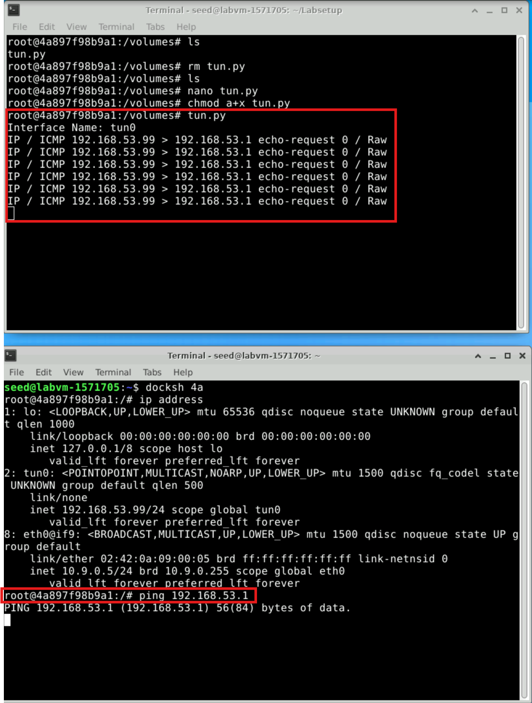
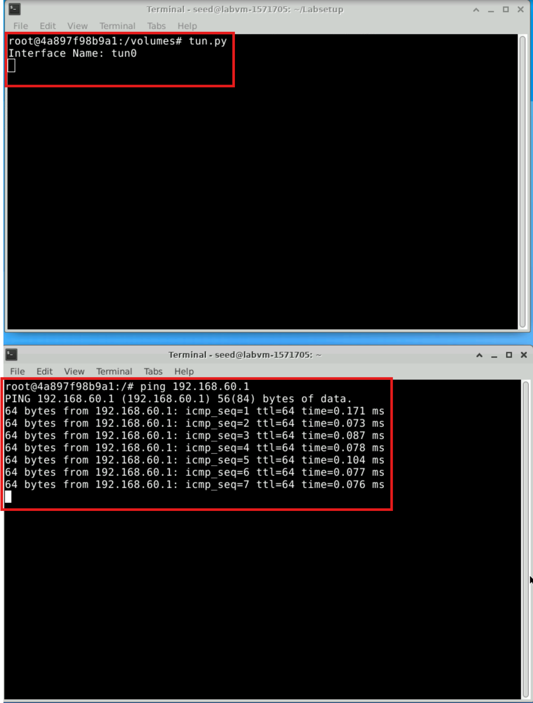
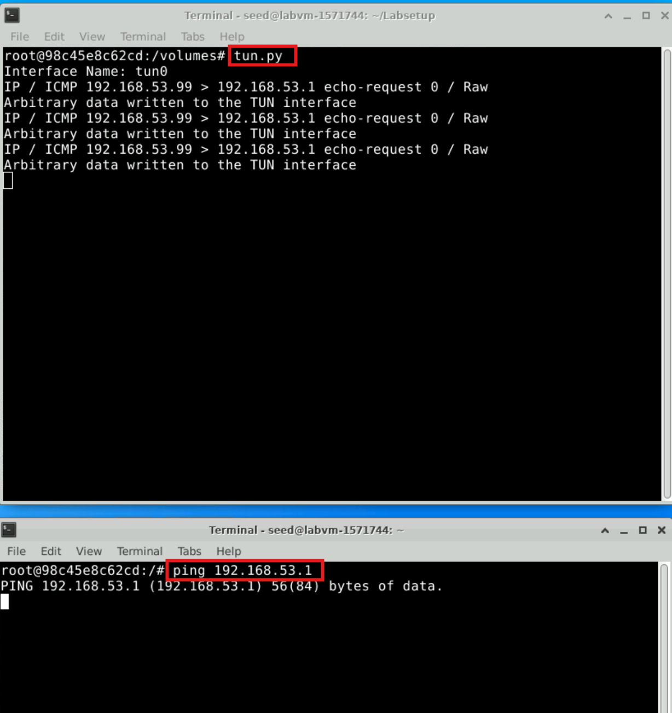
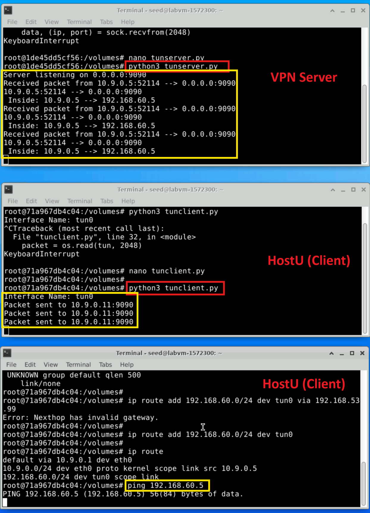
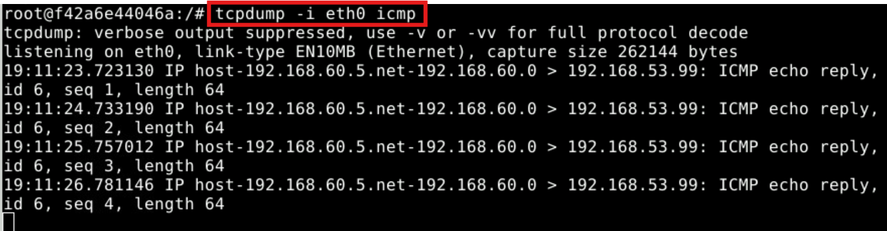
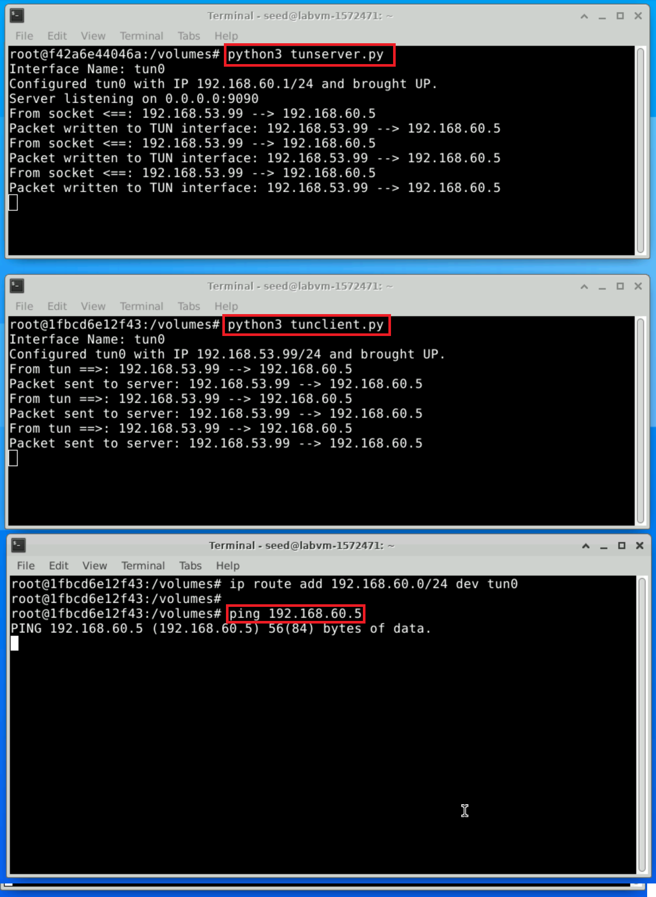

# Lab 7: VPN Lab: The Container Version

```
Copyright © 2020 by Wenliang Du.
This work is licensed under a Creative Commons Attribution-NonCommercial-ShareAlike 4.0 International
License. If you remix, transform, or build upon the material, this copyright notice must be left intact, or
reproduced in a way that is reasonable to the medium in which the work is being re-published.
```
## 1 Overview

A Virtual Private Network (VPN) is a private network built on top of a public network, usually the Internet.
Computers inside a VPN can communicate securely, just like if they were on a real private network that is
physically isolated from outside, even though their traffic may go through a public network. VPN enables
employees to securely access a company’s intranet while traveling; it also allows companies to expand their
private networks to places across the country and around the world.
The objective of this lab is to help students understand how VPN works. We focus on a specific type of
VPN (the most common type), which is built on top of the transport layer. We will build a very simple VPN
from the scratch, and use the process to illustrate how each piece of the VPN technology works. A real VPN
program has two essential pieces, tunneling and encryption. This lab only focuses on the tunneling part,
helping students understand the tunneling technology, so the tunnel in this lab is not encrypted. The lab covers the following topics:

- Virtual Private Network
- The TUN/TAP virtual interface
- IP tunneling
- Routing

**Lab environment**. Files needed for this lab are included in Labsetup.zip, which can be fetched by running the following commands.

```
# Download the lab setup files
$ sudo wget https://seedsecuritylabs.org/Labs_20.04/Files/VPN_Tunnel/Labsetup.zip

# Unzip the lab setup files
$ sudo unzip Labsetup.zip
```

## 2 Task 1: Network Setup

We will create a VPN tunnel between a computer (client) and a gateway, allowing the computer to securely
access a private network via the gateway. We need at least three machines: VPN client (also serving as
HostU), VPN server (the router/gateway), and a host in the private network (HostV). The network setup is
depicted in Figure 1.


`Figure 1: Lab environment setup`

In practice, the VPN client and VPN server are connected via the Internet. For the sake of simplicity,
we directly connect these two machines to the same LAN in this lab, i.e., this LAN simulates the Internet.
The third machine, HostV, is a computer inside the private network. Users on HostU (outside of the
private network) want to communicate with HostV via the VPN tunnel. To simulate this setup, we connect
HostV to VPN Server (also serving as a gateway). In such a setup, HostV is not directly accessible from
the Internet; nor is it directly accessible from HostU.

**Lab setup**. Please download the Labsetup.zip file to your VM from the lab’s website, unzip it, enter
the Labsetup folder, and use the docker-compose.yml file to set up the lab environment. Detailed
explanation of the content in this file and all the involved `Dockerfile` can be found from the user manual,
which is linked to the website of this lab. 

In the following, we list some of the commonly used commands related to Docker and Compose. Since
we are going to use these commands very frequently, we have created aliases for them in the .bashrc file
(in our provided SEEDUbuntu 20.04 VM).

**Build the Docker Container**. Use Docker Compose to build the container image. This step prepares the environment for running your web server with the required configurations.

```
# Build the Docker container
$ docker-compose build

# OR use the alias
$ dcbuild
```

**Start the Docker Container**. This command initializes and runs the container based on the configurations specified in the docker-compose.yml file.

```
# Start the Docker container
$ docker-compose up

# OR use the alias
$ dcup
```

**Stop and Shut Down the Docker Container**. When you’re finished or need to reset the environment, shut down the running container to release resources.

```
# Stop and shut down the Docker container
$ docker-compose down

# OR use the alias
$ dcdown
```
 
All the containers will be running in the background. To run commands on a container, we often need
to get a shell on that container. We first need to use the `"docker ps"` command to find out the ID of
the container, and then use `"docker exec"` to start a shell on that container. We have created aliases for
them in the `.bashrc` file.

**List Running Docker Containers**. Use the alias dockps to view a list of running containers, displaying each container's ID and name in a simplified format.

```
$ dockps
```

#### Output
The output will list all running Docker containers, each with its unique ID and assigned name. An example output might look like this:

```
b1004832e275 hostA-10.9.0.5
0af4ea7a3e2e hostB-10.9.0.6
9652715c8e0a hostC-10.9.0.7
```
Each line includes the container ID and its corresponding name (in this case, hostA, hostB, and hostC), along with their assigned IP addresses.

**Access a Specific Container’s Shell**. To open a shell inside a specific container, use the alias docksh followed by the first few characters of the container's ID. For example, to access hostC, use the ID prefix 96 (from the third line in the previous output).

```
$ docksh 96
```

#### Output
You will be logged into a shell session inside the specified container. The prompt will change to show the container ID, indicating that you are now inside the container:

```
root@9652715c8e0a:/#
```

#### Note: If a Docker command requires the container ID, you only need to type the first few characters, as long as they are unique among all running containers.


**Shared folder**. In this lab, we need to write our own code and run it inside containers. Code editing is
more convenient inside the VM than in containers, because we can use our favorite editors. In order for the
VM and container to share files, we have created a shared folder between the VM and the container using
the Docker volumes. If you look at the Docker Compose file, you will find out that we have added the
following entry to some of the containers. It indicates mounting the ./volumes folder on the host machine
(i.e., the VM) to the /volumes folder inside the container. We will write our code in the./volumes
folder (on the VM), so they can be used inside the containers.

```
volumes:
    - ./volumes:/volumes
```

**Packet sniffing**. Being able to sniffing packets is very important in this lab, because if things do not go
as expected, being able to look at where packets go can help us identify the problems. There are several
different ways to do packet sniffing:

- Running `tcpdump` on containers. We have already installed `tcpdump` on each container. To sniff
    the packets going through a particular interface, we just need to find out the interface name, and then
    do the following (assume that the interface name is eth0):

  ```
    # tcpdump -i eth0 -n
  ```
  

  
It should be noted that inside containers, due to the isolation created by Docker, when we run `tcpdump` inside a container, we can only sniff the packets going in and out of this container. We won’t be able to sniff the packets between other containers. However, if a container uses the host mode in its network setup, it can sniff other containers’ packets.

- Running `tcpdump` on the VM. If we run `tcpdump` on the VM, we do not have the restriction on the
    containers, and we can sniff all the packets going among containers. The interface name for a network
    is different on the VM than on the container. On containers, each interface name usually starts with
    eth; on the VM, the interface name for the network created by Docker starts with br-, followed by
    the ID of the network. You can always use the `ip address` command to get the interface name on
    the VM and containers.
  
   

  - We can also run Wireshark on the VM to sniff packets. Similar to `tcpdump`, we need to select what
    interface we want Wireshark to sniff on.

**Testing**. Please conduct the following testings to ensure that the lab environment is set up correctly:

- HostU can communicate with VPN Server.
- VPN Server can communicate with HostV.
- HostU should not be able to communicate with HostV.
- Run tcpdump on the router, and sniff the traffic on each of the network. Show that you can capture
    packets.

     - From HostU (Client), ping the VPN  Server to confirm communication using `ping 10.9.0.11`
     
        
       
     - From HostU (Client), attempt to ping HostV using `ping 192.168.60.5` to ensure it is not accessible.
     
        
     
     - From VPN Server (Router), ping HostU to verify connectivity using `ping 10.9.0.5`.
     
        
       
     - From VPN Server (Router), ping HostV to confirm access to the private network using `ping 192.168.60.5`.
     
        

## 3 Task 2: Create and Configure TUN Interface

The VPN tunnel that we are going to build is based on the TUN/TAP technologies. TUN and TAP are virtual
network kernel drivers; they implement network device that are supported entirely in software. TAP (as in
network tap) simulates an Ethernet device and it operates with layer-2 packets such as Ethernet frames;
TUN (as in network TUNnel) simulates a network layer device and it operates with layer-3 packets such as
IP packets. With TUN/TAP, we can create virtual network interfaces.
A user-space program is usually attached to the TUN/TAP virtual network interface. Packets sent by an
operating system via a TUN/TAP network interface are delivered to the user-space program. On the other
hand, packets sent by the program via a TUN/TAP network interface are injected into the operating system
network stack. To the operating system, it appears that the packets come from an external source through
the virtual network interface.
When a program is attached to a TUN/TAP interface, IP packets sent by the kernel to this interface will
be piped into the program. On the other hand, IP packets written to the interface by the program will be
piped into the kernel, as if they came from the outside through this virtual network interface. The program
can use the standard read() and write() system calls to receive packets from or send packets to the
virtual interface.
The objective of this task is to get familiar with the TUN/TAP technology. We will conduct several
experiments to learn the technical details of the TUN/TAP interface. We will use the following Python
program as the basis for the experiments, and we will modify this base code throughout this lab. The code
is already included in the `volumes` folder in the zip file.

`Listing 1: Creating a TUN interface (tun.py)`

```
#!/usr/bin/env python3

import fcntl
import struct
import os
import time
from scapy.all import *

TUNSETIFF = 0x400454ca
IFF_TUN   = 0x0001
IFF_TAP   = 0x0002
IFF_NO_PI = 0x1000

# Create the tun interface
tun = os.open("/dev/net/tun", os.O_RDWR)
ifr = struct.pack('16sH', b'tun%d', IFF_TUN | IFF_NO_PI)
ifname_bytes  = fcntl.ioctl(tun, TUNSETIFF, ifr)

# Get the interface name
ifname = ifname_bytes.decode('UTF-8')[:16].strip("\x00")
print("Interface Name: {}".format(ifname))

while True:
   time.sleep(10)
```

### 3.1 Task 2.a: Name of the Interface

We will run the `tun.py` program on HostU. Make the `tun.py` program executable and run it using root privileges. 
To modify and prepare `tun.py`, update the program to set a custom prefix for the interface name, as shown in the following figure. You can access the Python file by navigate to the `tun.py` file in the shared directory `volume`, as shown in the figure.

  

You need to update the following line in the program `ifr = struct.pack('16sH', b'tun%d', IFF_TUN | IFF_NO_PI)`.

  

```
// Make the Python program executable
# chmod a+x tun.py

// Run the program using the root privilege
# tun.py
```

Once the program is executed, it will block. You can go to another terminal and get a new shell on the
container. Then print out all the interfaces on the machine. Please report your observation after running the
following command:

```
# ip address
```
  

You should be able to find an interface called `tun0`. Your job in this task is to change the `tun.py`
program, so instead of using `tun` as the prefix of the interface name, use your last name as the prefix. For
example, if your last name is smith, you should use smith as the prefix. If your last name is long, you can
use the first five characters. Please show your results.

### 3.2 Task 2.b: Set up the TUN Interface

At this point, the TUN interface is not usable, because it has not been configured yet. There are two things
that we need to do before the interface can be used. First, we need to assign an IP address to it. Second, we
need to bring up the interface, because the interface is still in the down state. We can use the following two
commands for the configuration:

```
// Assign IP address to the interface
# ip addr add 192.168.53.99/24 dev tun


// Bring up the interface
# ip link set dev tun0 up
```

To make life easier, students can add the following two lines of code totun.py, so the configuration
can be automatically performed by the program.

```
os.system("ip addr add 192.168.53.99/24 dev {}".format(ifname))
os.system("ip link set dev {} up".format(ifname))
```

The following is the updated code with crating the TUN interface:

```
#!/usr/bin/env python3

import fcntl
import struct
import os
import time
from scapy.all import *

TUNSETIFF = 0x400454ca
IFF_TUN   = 0x0001
IFF_TAP   = 0x0002
IFF_NO_PI = 0x1000

# Create the tun interface
tun = os.open("/dev/net/tun", os.O_RDWR)
ifr = struct.pack('16sH', b'tun%d', IFF_TUN | IFF_NO_PI)
ifname_bytes  = fcntl.ioctl(tun, TUNSETIFF, ifr)

# Get the interface name
ifname = ifname_bytes.decode('UTF-8')[:16].strip("\x00")
print("Interface Name: {}".format(ifname))

# Configure the TUN interface
os.system("ip addr add 192.168.53.99/24 dev {}".format(ifname))
os.system("ip link set dev {} up".format(ifname))

while True:
   time.sleep(10)
```
After running the two commands above and the `ip address` command again, the TUN interface changes from DOWN to UP, and it is assigned the IP address 192.168.53.99/24. This makes the interface active and ready to send or receive packets, enabling it to function as part of the VPN tunnel.

  

### 3.3 Task 2.c: Read from the TUN Interface

In this task, we will read from the TUN interface. Whatever coming out from the TUN interface is an IP
packet. We can cast the data received from the interface into a Scapy IP object, so we can print out each
field of the IP packet. Please use the following while loop to replace the one intun.py:

```
while True:
    # Get a packet from the tun interface
    packet = os.read(tun, 2048)
    if packet:
        ip = IP(packet)
        print(ip.summary())
```

This is the updated code:

```
#!/usr/bin/env python3

import fcntl
import struct
import os
import time
from scapy.all import *

TUNSETIFF = 0x400454ca
IFF_TUN   = 0x0001
IFF_TAP   = 0x0002
IFF_NO_PI = 0x1000

# Create the tun interface
tun = os.open("/dev/net/tun", os.O_RDWR)
ifr = struct.pack('16sH', b'tun%d', IFF_TUN | IFF_NO_PI)
ifname_bytes  = fcntl.ioctl(tun, TUNSETIFF, ifr)

# Get the interface name
ifname = ifname_bytes.decode('UTF-8')[:16].strip("\x00")
print("Interface Name: {}".format(ifname))

# Configure the TUN interface
os.system("ip addr add 192.168.53.99/24 dev {}".format(ifname))
os.system("ip link set dev {} up".format(ifname))

while True:
    # Get a packet from the tun interface
    packet = os.read(tun, 2048)
    if packet:
        ip = IP(packet)
        print(ip.summary())
```

After running the revised `tun.py` program on HostU and configure the TUN interface with the assigned IP address (192.168.53.99/24). You can notice the following:

- When you ping a host in the 192.168.53.0/24 network, the tun.py program captures the ICMP echo request packets sent by the ping command. The program prints packet summaries, including the source IP, destination IP, and protocol details. This happens because packets in the 192.168.53.0/24 network are routed through the TUN interface.
 
  
  
- When you ping a host in the 192.168.60.0/24 network, the tun.py program does not capture any packets. This is because packets destined for the 192.168.60.0/24 network are not routed through the TUN interface, so the program does not process them.

  

### 3.4 Task 2.d: Write to the TUN Interface

In this task, we will write to the TUN interface. Since this is a virtual network interface, whatever is written
to the interface by the application will appear in the kernel as an IP packet.
We will modify the `tun.py` program, so after getting a packet from the TUN interface, we construct a
new packet based on the received packet. We then write the new packet to the TUN interface. How the new
packet is constructed is up to students. The code in the following shows an example of how to write an IP
packet to the TUN interface.

```
# Send out a spoof packet using the tun interface
newip = IP(src=’1.2.3.4’, dst=ip.src)
newpkt = newip/ip.payload
os.write(tun, bytes(newpkt))
```

This is the modified `tun.py` code:

```
#!/usr/bin/env python3

import fcntl
import struct
import os
import time
from scapy.all import *

TUNSETIFF = 0x400454ca
IFF_TUN   = 0x0001
IFF_TAP   = 0x0002
IFF_NO_PI = 0x1000

# Create the tun interface
tun = os.open("/dev/net/tun", os.O_RDWR)
ifr = struct.pack('16sH', b'tun%d', IFF_TUN | IFF_NO_PI)
ifname_bytes  = fcntl.ioctl(tun, TUNSETIFF, ifr)

# Get the interface name
ifname = ifname_bytes.decode('UTF-8')[:16].strip("\x00")
print("Interface Name: {}".format(ifname))

# Configure the TUN interface
os.system("ip addr add 192.168.53.99/24 dev {}".format(ifname))
os.system("ip link set dev {} up".format(ifname))

while True:
    # Get a packet from the tun interface
    packet = os.read(tun, 2048)
    if packet:
        ip = IP(packet)
        print(ip.summary())

        # Send out a spoofed packet using the TUN interface
        if ip.proto == 1:  # ICMP protocol
           newip = IP(src='1.2.3.4', dst=ip.src)
           newpkt = newip / ip.payload
           os.write(tun, bytes(newpkt))

    # Write arbitrary data for testing 
    print("Arbitrary data written to the TUN interface")
```

  

The tun.py code was implemented to process ICMP echo requests and handle packet modification through the TUN interface. It reads packets, identifies ICMP echo requests, and constructs spoofed packets with a hardcoded source IP address (1.2.3.4) before writing them back to the interface. The program was tested by pinging the TUN interface (192.168.53.1) and successfully logged the receipt of ICMP packets and transmission of spoofed packets. While it demonstrates basic packet handling, it does not fully implement true ICMP echo reply behavior. Additionally, the program logs writing arbitrary data.

## 4 Task 3: Send the IP Packet to VPN Server Through a Tunnel

In this task, we will put the IP packet received from the TUN interface into the UDP payload field of a new
IP packet, and send it to another computer. Namely, we place the original packet inside a new packet. This
is called IP tunneling. The tunnel implementation is just standard client/server programming. It can be built
on top of TCP or UDP. In this task, we will use UDP. Namely, we put an IP packet inside the payload field
of a UDP packet.

The server program **tunserver.py**. We will runtunserver.pyprogram on VPN Server. This
program is just a standard UDP server program. It listens to port 9090 and print out whatever is received.
The program assumes that the data in the UDP payload field is an IP packet, so it casts the payload to a
ScapyIPobject, and print out the source and destination IP address of the enclosed IP packet.

`Listing 2:tunserver.py`

```
#!/usr/bin/env python

from scapy.all import *

IP_A = "0.0.0.0"
PORT = 9090

sock = socket.socket(socket.AF_INET, socket.SOCK_DGRAM)
sock.bind((IP_A, PORT))

while True:
    data, (ip, port) = sock.recvfrom(2048)
    print("{}:{} --> {}:{}".format(ip, port, IP_A, PORT))
    pkt = IP(data)
    print(" Inside: {} --> {}".format(pkt.src, pkt.dst))
```

Implement the client program **tunclient.py**. First, we need to modify the TUN program `tun.py`.
Let’s rename it, and call it `tunclient.py`. Sending data to another computer using UDP can be done
using the standard socket programming.
Replace the while loop in the program with the following: The `SERVERIP` and `SERVERPORT` should be replaced with the actual IP address and port number of the server program running on VPN
Server.

```
# Create UDP socket
sock = socket.socket(socket.AF_INET, socket.SOCK_DGRAM)

while True:
    # Get a packet from the tun interface
    packet = os.read(tun, 2048)
    if packet:
        # Send the packet via the tunnel
        sock.sendto(packet, (SERVER_IP, SERVER_PORT))
```

The update `tunclient.py` code should be something like this:
```
#!/usr/bin/env python3

import fcntl
import struct
import os
import socket
from scapy.all import *

TUNSETIFF = 0x400454ca
IFF_TUN   = 0x0001
IFF_TAP   = 0x0002
IFF_NO_PI = 0x1000

# Create the TUN interface
tun = os.open("/dev/net/tun", os.O_RDWR)
ifr = struct.pack('16sH', b'tun%d', IFF_TUN | IFF_NO_PI)
ifname_bytes = fcntl.ioctl(tun, TUNSETIFF, ifr)

# Get the interface name
ifname = ifname_bytes.decode('UTF-8')[:16].strip("\x00")
print(f"Interface Name: {ifname}")

# Configure the TUN interface
os.system(f"ip addr add 192.168.53.99/24 dev {ifname}")
os.system(f"ip link set dev {ifname} up")

# Client Configuration
SERVER_IP = "10.9.0.11"
SERVER_PORT = 9090

# Create a UDP socket
sock = socket.socket(socket.AF_INET, socket.SOCK_DGRAM)

while True:
    # Read a packet from the TUN interface
    packet = os.read(tun, 2048)
    if packet:
        print(f"Packet read from TUN interface: {IP(packet).summary()}")
        
        # Send the packet to the VPN server
        sock.sendto(packet, (SERVER_IP, SERVER_PORT))
        print(f"Packet sent to {SERVER_IP}:{SERVER_PORT}")
```


**Testing.** To test whether the tunnel works, first run the `tunserver.py` program on the VPN Server. The server will listen on port `9090` for incoming UDP packets. Next, run the `tunclient.py` program on HostU. The client will configure the TUN interface (tun0), capture packets sent to it, encapsulate them in UDP packets, and send them to the VPN Server. 
To test the tunnel, ping any IP address in the `192.168.53.0/24` network (e.g., 192.168.53.1) from HostU. On the VPN Server, the `tunserver.py` program will print logs showing the source and destination IPs of the received packets. For example, you may see output like this: 10.9.0.11:12345 --> 0.0.0.0:9090 and Inside: 192.168.53.99 --> 192.168.53.1. This confirms that the ICMP echo request packet was successfully forwarded from the TUN interface on HostU through the tunnel to the VPN Server, where it was received and processed.

To achieve the ultimate goal of accessing hosts inside the private network 192.168.60.0/24 using the tunnel, you need to route packets destined for this network to the TUN interface on HostU. This can be done by adding a route with the following command on HostU: 
```
ip route add 192.168.60.0/24 dev tun0
```
Once this route is added, any packets sent to the 192.168.60.0/24 network will be captured by tunclient.py, encapsulated in UDP, and sent to the VPN Server. When you ping a host in the 192.168.60.0/24 network, such as HostV (192.168.60.5), the VPN Server will log the packet details, confirming that the ICMP echo request packet was received through the tunnel.

If the ICMP packets do not appear on the VPN Server, ensure the TUN interface on HostU is up `ip link set dev tun0 up` and verify the route configuration. The output on the VPN Server will show packets received through the tunnel, demonstrating that the tunnel is correctly forwarding packets for the private network.

  

<!---
Run the `tunserver.py` program on VPN Server, and then run `tunclient.py` on HostU. To test whether the tunnel works or not,ping any IP address belonging to the 192.168.53.0/
network. What is printed out on VPN Server? Why?
Our ultimate goal is to access the hosts inside the private network 192.168.60.0/24 using the
tunnel. Let us ping HostV, and see whether the ICMP packet is sent to VPN Server through the tunnel.
If not, what are the problems? You need to solve this problem, so the ping packet can be sent through
the tunnel. This is done through routing, i.e., packets going to the 192.168.60.0/24 network should
be routed to the TUN interface and be given to the `tunclient.py` program. The following command
shows how to add an entry to the routing table:

```
# ip route add <network> dev <interface> via <router ip>
```

Please demonstrate that when you ping an IP address in the192.168.60.0/
network, the ICMP packets are received by `tunserver.py` through the tunnel.
--->

## 5 Task 4: Set Up the VPN Server

This task involves modifying the VPN Server program `tunserver.py` so that it can process packets received from the tunnel, feed them to the kernel through a TUN interface, and forward them to their final destination. You will also enable IP forwarding to ensure the server can act as a gateway. This needs to be done through a TUN interface, just like what we did in Task 2. 

Before running the modified `tunserver.py`, we need to enable the IP forwarding. Unless specifi-
cally configured, a computer will only act as a host, not as a gateway. VPN Server needs to forward packets
between the private network and the tunnel, so it needs to function as a gateway. We need to enable the IP
forwarding for a computer to behave like a gateway. IP forwarding has already been enabled on the router
container. You can see in `docker-compose.yml` that the router container has the following entry:

```
sysctls:
    - net.ipv4.ip_forward=1
```

Run the following command to verify the current IP forwarding status:

```
sysctl net.ipv4.ip_forward
```

Then, you need to modify `tunserver.py`, so it can do the following:

- Create a TUN interface and configure it.
- Get the data from the socket interface; treat the received data as an IP packet.
- Write the packet to the TUN interface.

The updated `tunserver.py` code will be like this:

```
#!/usr/bin/env python3

import fcntl
import struct
import os
import socket
from scapy.all import *

TUNSETIFF = 0x400454ca
IFF_TUN   = 0x0001
IFF_TAP   = 0x0002
IFF_NO_PI = 0x1000

# Create the TUN interface
tun = os.open("/dev/net/tun", os.O_RDWR)
ifr = struct.pack('16sH', b'tun%d', IFF_TUN | IFF_NO_PI)
ifname_bytes = fcntl.ioctl(tun, TUNSETIFF, ifr)

# Get the interface name
ifname = ifname_bytes.decode('UTF-8')[:16].strip("\x00")
print(f"Interface Name: {ifname}")

# Configure the TUN interface
os.system(f"ip addr add 192.168.60.1/24 dev {ifname}")
os.system(f"ip link set dev {ifname} up")

# UDP socket for receiving packets from the client
IP_A = "0.0.0.0"
PORT = 9090
sock = socket.socket(socket.AF_INET, socket.SOCK_DGRAM)
sock.bind((IP_A, PORT))
print(f"Server listening on {IP_A}:{PORT}")

while True:
    # Receive a packet from the tunnel
    data, (ip, port) = sock.recvfrom(2048)
    print(f"Received packet from {ip}:{port}")

    # Parse the UDP payload as an IP packet
    pkt = IP(data)
    print(f"Inside Packet: {pkt.src} --> {pkt.dst}")

    # Write the packet to the TUN interface
    os.write(tun, bytes(pkt))
    print(f"Packet written to TUN interface: {ifname}")
```

Then, On the VPN Server, execute:

```
python3 tunserver.py
```

**Testing.** The testing process confirmed that the setup was successful. ICMP echo request packets from HostU were sent through the tunnel to the VPN Server and eventually reached HostV. Using `tcpdump` on HostV, it was verified that the ICMP packets arrived as expected, demonstrating that the VPN Server successfully forwarded the packets from the TUN interface to their destination. Although HostV responded to the ICMP echo requests with echo replies, the replies did not return to HostU because reverse tunneling has not yet been configured. This behavior aligns with the current setup, where the focus is on ensuring that packets can traverse the tunnel and reach their intended destination. The following `tcpdump` output shows that the ICMP packets were correctly delivered to HostV.

<!---
If everything is set up properly, we can ping HostV from HostU. The ICMP echo request
packets should eventually arrive at `HostV` through the tunnel. Please show your proof. It should be noted
that although HostV will respond to the ICMP packets, the reply will not get back to HostU, because we
have not set up everything yet. Therefore, for this task, it is sufficient to show (using Wireshark or tcpdump)
that the ICMP packets have arrived at HostV.
--->

  


## 6 Task 5: Handling Traffic in Both Directions

After getting to this point, one direction of your tunnel is complete, i.e., we can send packets from HostU
to HostV via the tunnel. If we look at the Wireshark trace on HostV, we can see that HostV has sent out
the response, but the packet gets dropped somewhere. This is because our tunnel is only one directional; we
need to set up its other direction, so returning traffic can be tunneled back to Host U.
To achieve that, our TUN client and server programs need to read data from two interfaces, the TUN
interface and the socket interface. All these interfaces are represented by file descriptors, so we need to
monitor them to see whether there are data coming from them. One way to do that is to keep polling them,
and see whether there are data on each of the interfaces. The performance of this approach is undesirable,
because the process has to keep running in an idle loop when there is no data. Another way is to read from
an interface. By default, read is blocking, i.e., the process will be suspended if there are no data. When
data become available, the process will be unblocked, and its execution will continue. This way, it does not
waste CPU time when there is no data.

The read-based blocking mechanism works well for one interface. If a process is waiting on multiple
interfaces, it cannot block on just one of the interfaces. It has to block on all of them altogether. Linux has a
system call called select(), which allows a program to monitor multiple file descriptors simultaneously.
To useselect(), we need to store all the file descriptors to be monitored in a set, and then we give the
set to the select() system call, which will block the process until data are available on one of the file
descriptors in the set. We can check which file descriptor has received data. In the following Python code
snippet, we use select() to monitor aTUNand a socket file descriptor.

```
# We assume that sock and tun file descriptors have already been created.

while True:
    # this will block until at least one interface is ready
    ready, _, _ = select.select([sock, tun], [], [])
    
    for fd in ready:
        if fd is sock:
            data, (ip, port) = sock.recvfrom(2048)
            pkt = IP(data)
            print("From socket <==: {} --> {}".format(pkt.src, pkt.dst))
            ... (code needs to be added by students) ...
    
    if fd is tun:
        packet = os.read(tun, 2048)
        pkt = IP(packet)
        print("From tun ==>: {} --> {}".format(pkt.src, pkt.dst))
        ... (code needs to be added by students) ...
```

Below are the updated `tunserver.py` and `tunclient.py` programs for handling bidirectional traffic.

`tunserver.py`

```
#!/usr/bin/env python3

import fcntl
import struct
import os
import socket
import select
from scapy.all import *

TUNSETIFF = 0x400454ca
IFF_TUN = 0x0001
IFF_NO_PI = 0x1000

# Create the TUN interface
tun = os.open("/dev/net/tun", os.O_RDWR)
ifr = struct.pack('16sH', b'tun%d', IFF_TUN | IFF_NO_PI)
ifname_bytes = fcntl.ioctl(tun, TUNSETIFF, ifr)

# Get the interface name
ifname = ifname_bytes.decode('UTF-8')[:16].strip("\x00")
print(f"Interface Name: {ifname}")

# Configure the TUN interface
os.system(f"ip addr add 192.168.60.1/24 dev {ifname}")
os.system(f"ip link set dev {ifname} up")
print(f"Configured {ifname} with IP 192.168.60.1/24 and brought UP.")

# Create a UDP socket to communicate with the client
IP_A = "0.0.0.0"
PORT = 9090
sock = socket.socket(socket.AF_INET, socket.SOCK_DGRAM)
sock.bind((IP_A, PORT))
print(f"Server listening on {IP_A}:{PORT}")

while True:
    # Monitor both the TUN interface and the UDP socket
    ready, _, _ = select.select([sock, tun], [], [])

    for fd in ready:
        if fd is sock:  # Data received from the client
            data, (ip, port) = sock.recvfrom(2048)
            pkt = IP(data)
            print(f"From socket <==: {pkt.src} --> {pkt.dst}")

            # Write the packet to the TUN interface
            os.write(tun, bytes(pkt))
            print(f"Packet written to TUN interface: {pkt.src} --> {pkt.dst}")

        if fd is tun:  # Data received from the TUN interface
            packet = os.read(tun, 2048)
            pkt = IP(packet)
            print(f"From tun ==>: {pkt.src} --> {pkt.dst}")

            # Send the packet back to the client via UDP
            sock.sendto(packet, (ip, port))
            print(f"Packet sent back to client: {pkt.src} --> {pkt.dst}")
```

`tunclient.py`

```
#!/usr/bin/env python3

import fcntl
import struct
import os
import socket
import select
from scapy.all import *

TUNSETIFF = 0x400454ca
IFF_TUN = 0x0001
IFF_NO_PI = 0x1000

# Create the TUN interface
tun = os.open("/dev/net/tun", os.O_RDWR)
ifr = struct.pack('16sH', b'tun%d', IFF_TUN | IFF_NO_PI)
ifname_bytes = fcntl.ioctl(tun, TUNSETIFF, ifr)

# Get the interface name
ifname = ifname_bytes.decode('UTF-8')[:16].strip("\x00")
print(f"Interface Name: {ifname}")

# Configure the TUN interface
os.system(f"ip addr add 192.168.53.99/24 dev {ifname}")
os.system(f"ip link set dev {ifname} up")
print(f"Configured {ifname} with IP 192.168.53.99/24 and brought UP.")

# Client Configuration
SERVER_IP = "10.9.0.11"  # Replace with the VPN Server's IP address
SERVER_PORT = 9090

# Create a UDP socket to communicate with the server
sock = socket.socket(socket.AF_INET, socket.SOCK_DGRAM)

while True:
    # Monitor both the TUN interface and the UDP socket
    ready, _, _ = select.select([sock, tun], [], [])

    for fd in ready:
        if fd is tun:  # Data received from the TUN interface
            packet = os.read(tun, 2048)
            pkt = IP(packet)
            print(f"From tun ==>: {pkt.src} --> {pkt.dst}")

            # Send the packet to the VPN server via UDP
            sock.sendto(packet, (SERVER_IP, SERVER_PORT))
            print(f"Packet sent to server: {pkt.src} --> {pkt.dst}")

        if fd is sock:  # Data received from the server
            data, _ = sock.recvfrom(2048)
            pkt = IP(data)
            print(f"From socket <==: {pkt.src} --> {pkt.dst}")

            # Write the packet to the TUN interface
            os.write(tun, bytes(pkt))
            print(f"Packet written to TUN interface: {pkt.src} --> {pkt.dst}")
```

<!--- Students can use the code above to replace the while loop in their TUN client and server programs.
The code is incomplete; students are expected to complete it.
--->

**Testing.** Once this is done, we should be able to communicate with MachineV from MachineU, and the
VPN tunnel (un-encrypted) is now complete. You can use `wireshark` about `ping` and
`telnet` commands.

 

### You have successfully completed the lab
