# Lab 8: Networking Lab

To debug network and security problems, network administrators need to examine the configuration and status of the network on cluster nodes. There are a set of tools that enable inspecting and changing the configuration of the network devices and software stack. This lab will introduce students to a set of these tools. In particular, students will learn commands related to:

- Inspecting the configuration of the network devices
- Checking the status of the network stack

All the commands will be run using the command line interface (CLI). The CLI is a powerful tool for running applications, inspecting the system status, and configuring a machine.

First, open a terminal application. Click on the terminal application on the desktop.


The terminal opens showing the shell prompt as shown in the figure. The shell allows running commands and applications.


## 1. Check Local Machine Network with `ifconfig`

To check the local node configuration, we can use the following commands:

One of the common tools is `ifconfig`. `ifconfig` is a legacy command and is slowly being replaced by the `ip` command. Nevertheless, it is still widely supported. Users can access important information such as their network interface's IP address (Internet Protocol address), subnet mask, default gateway, and DNS server configurations by running the `ifconfig` command. It is a useful tool for quickly diagnosing network connectivity difficulties, validating network settings, and acquiring critical network information.

• Run `ifconfig` with no arguments to print essential information about all active network interfaces:

```bash
ifconfig
```

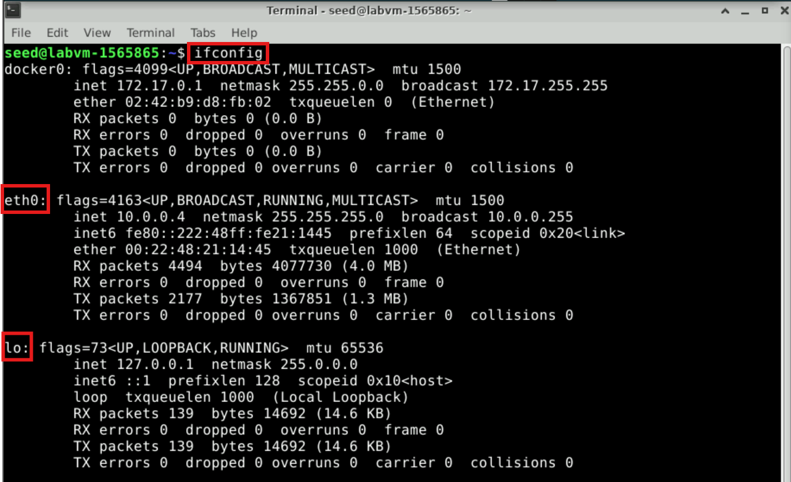

The output shows crucial data about the network interfaces, like:

- The names of the active network interfaces (e.g., eth0, enp0s3 and lo, the loopback interface).
- The hardware MAC address.
- The IP address (inet), netmask, and broadcast address.
- The MTU (Maximum Transmission Unit) value.
• Display more details with ifconfig

The verbose option (-v) prints a more detailed output. Depending on the system, the outcome is either the same as ifconfig without arguments or slightly more in-depth.

```bash
ifconfig -v
```

The output of the command shows additional stats about each interface, including the number of packets transmitted (TX) or received (RX) and stats about all transmission errors.

**Controlling Interfaces.** ifconfig can also be used to disable or enable an interface.

To disable the `enp0s3` interface, you can use the following command:

```
sudo ifconfig enp0s3 down
```

Use ifconfig to verify that the interface is down.

To bring an interface up again, you can use the following command:

```
sudo ifconfig enp0s3 up
```
Verify it with ifconfig.

## 2. Check Local Machine Network with `ip`
The `ip` command is the replacement for `ifconfig` and can do the same functionality and more. To list all the devices on a machine, use the following command:

```
ip link show
```

The output shows each interface.

To view the IP addresses as well, use the following command:

```
ip addr
```

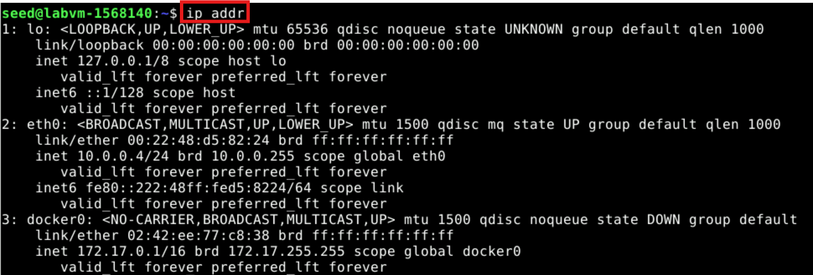

The output shows the IPv4 and/or IPv6 addresses.

To check the stats for the interface, use the "-s" option:

```
ip -s -s link show
```

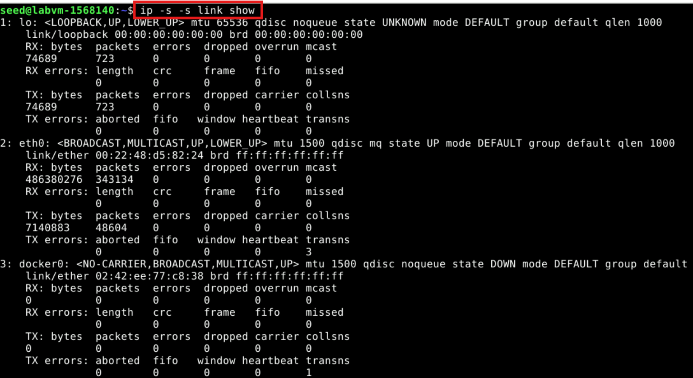

This shows the states on the transmission and reception side, including the number of packets processed and errors experienced.

---- Checking the Status of the Connections on a Machine

### `netstat`

The `netstat` command, as the name suggests, displays an overview of all the network connections in the device. The table shows details about the connection protocol, address, and the current state of the network.

The netstat command can be used without parameters to display active network connections:

```
netstat
```

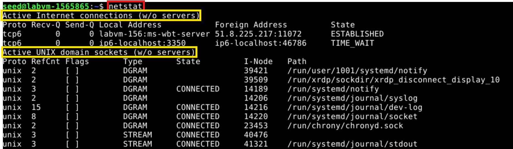

The output displays details of active internet connections across six columns:
- Proto: Protocol of the connection (e.g., TCP, UDP).
- Recv-Q: Number of bytes received and waiting in the queue to be processed.
- Send-Q: Number of bytes waiting in the queue to be sent.
- Local address: Local address and port of the connection. An asterisk (*) in the host indicates that the server is listening on all available interfaces, and a port may not yet be established.
- Foreign address: Remote address and port of the connection. An asterisk (*) appears if a connection is not yet established.
- State: State of the local socket. Values include ESTABLISHED, LISTENING, CLOSED, or blank.

The second list shows all active Unix Domain open sockets with the following details:
- Proto: Protocol used by the socket (always unix).
- RefCnt: Reference count of the number of processes attached to this socket.
- Flags: Flags associated with the socket, usually ACC or blank.
- Type: The socket type.
- State: State of the socket, most often CONNECTED, LISTENING, or blank.
- I-Node: File system inode (index node) associated with this socket.
- Path: File system path to the socket.
  
You can expand the netstat command with options to filter or customize output:
```
netstat [option]
```

OPTION	DESCRIPTION
- -a	Display all active TCP and UDP connections and listening ports.
- -t	Display only TCP connections.
- -u	Display only UDP connections.
- -l	Show only sockets that are actively listening for incoming connections.
- -p	Display the Process ID (PID) and program name associated with each socket.
- -n	Display addresses and port numbers in numeric format without resolving names.
- -r	Display the kernel routing table.
- -s	Provide summary statistics for each protocol.
- -c	Continuously update the output every second.
- -e	Display extended information, including timers and user IDs.

### `ss`

Another command that can display connection information is the `ss` command.

Use the `ss` command without arguments to list all connections on a machine:

```
ss
```

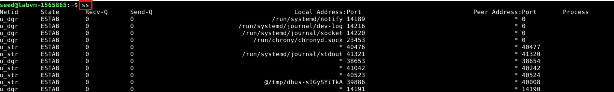

As with netstat, you can expand the `ss` command with options to filter or customize output.

-----Checking Network Operations

### `ping`

`ping` is the primary command used to troubleshoot connectivity, reachability, and name resolution. It allows admins to test if the network stack works properly, if the network is up, and if a certain destination is reachable. `ping` sends Internet Control Message Protocol (ICMP) echo request messages to a given destination. The destination will echo back the message to the sender. The tool measures the time and displays the round-trip times.

For instance, to check the connectivity to facebook.com, use the following command:

```
ping www.facebook.com
```

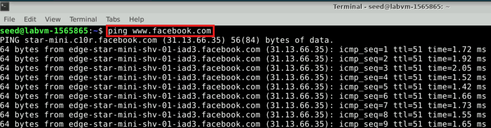

The output shows the Facebook server contacted for the ping (star-mini.c10r.facebook.com) and its IP address (31.13.66.35). It also shows multiple trials for ping and their round-trip times. At the end of the command, it shows stats about all trials and the average round-trip time.

### `traceroute`

Another command helpful for checking and debugging connectivity is `traceroute`. `traceroute` is a command-line utility that you can use to trace the path that an Internet Protocol (IP) packet takes to its destination. This tool helps debug connectivity issues and detect any anomalies in the path. It can also be used to detect if a malicious entity has hacked the network to change the path to go through untrusted networks.

`traceroute` determines the route to a destination by sending ICMP echo packets to the destination. In these packets, `traceroute` uses varying IP Time-To-Live (TTL) values. Because each router along the path is required to decrease the packet's TTL by at least 1 before forwarding the packet, the TTL is effectively a hop counter. When the TTL on a packet reaches zero (0), the router sends an ICMP "Time Exceeded" message back to the source computer.

`traceroute` sends the first echo packet with a TTL of 1 and increments the TTL by 1 on each subsequent transmission, until the destination responds or until the maximum TTL is reached. The ICMP "Time Exceeded" messages that intermediate routers send back show the route. Note, however, that some routers silently drop packets that have expired TTLs, and these packets are invisible to `traceroute`.

`traceroute` prints out an ordered list of the intermediate routers that return ICMP "Time Exceeded" messages. Using the -d option with the traceroute command instructs traceroute not to perform a DNS lookup on each IP address, so that traceroute reports the IP address of the near-side interface of the routers.

Compared to ping, the primary difference between ping and traceroute is that while ping simply tells you if a server is reachable and the time it takes to transmit and receive data, traceroute details the precise route info, router by router, as well as the time it took for each hop.

To check the path to facebook.com, use the following command:

```
traceroute www.facebook.com
```

----Inspecting the Network Communication

### `tcpdump`

`tcpdump` is a command-line tool used to capture and examine network traffic on your system. It's commonly used for troubleshooting network problems and as a security tool. `tcpdump` is very flexible, with many options and filters to suit different needs. Since it runs in the command line, it's perfect for use on remote servers or devices without a graphical interface.

To use `tcpdump`, we need to determine which netwrok interface is active using `ifconfig` or `ip addr` as we mentioned earlier. We will use `eth0` interface to monitor network traffic. Since `tcpdump` works with IP addresses, resolve `www.facebook.com` to its IP address using the `ping` command.

```
ping www.facebook.com
```

The output is something like this:
```
PING star-mini.c10r.facebook.com (31.13.66.35) 56(84) bytes of data.
```
In this case, the IP address of `www.facebook.com` is `31.13.66.35`.

You will run `tcpdump` to capture traffic to and from the resolved IP address (31.13.66.35) with the the active network interface `eth0`. Use the following command:

```
sudo tcpdump -i eth0 host 31.13.66.35
```

While `tcpdump` is running, we need to generate network traffic to `www.facebook.com` by opening it in the browser or using a tool like `curl` using this command:

```
curl www.facebook.com
```

This will send HTTP requests, and `tcpdump` will capture the packets. The output of `tcpdump` will display the captured packets as shown in the following figure:

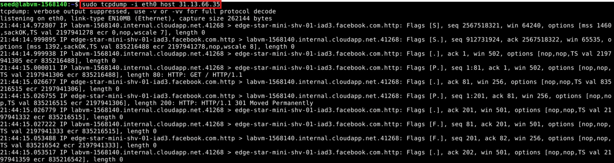

### `Tshark/Wireshark`
`Wireshark` is another tool used to capture and inspect packets in real-time. It allows users to monitor network traffic, troubleshoot issues, and analyze communication between devices. `Wireshark` provides detailed insights into network protocols such as DNS, HTTP, TCP, and UDP. Its intuitive graphical interface makes it easy to filter, capture, and analyze packets, helping users identify connectivity problems, security vulnerabilities, or performance bottlenecks in networks.

- Launch `Wireshark` from your desktop.
- You will see a list of available network interfaces, choose the interface connected to the internet `eth0`.
- Double-click the interface to start capturing packets

  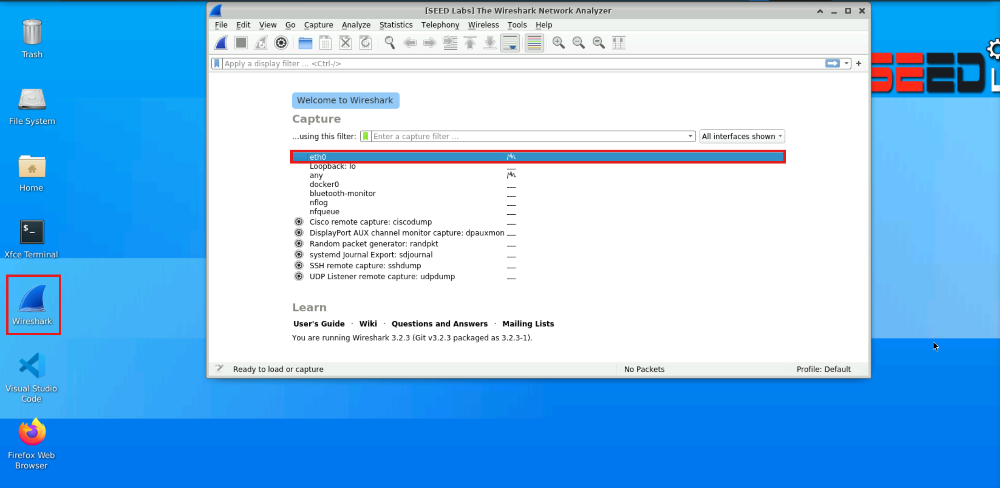
  
- To filter traffic while capturing or viewing, use the filter bar at the top.
- There are some common filters you can use like:
  - DNS Traffic: dns

     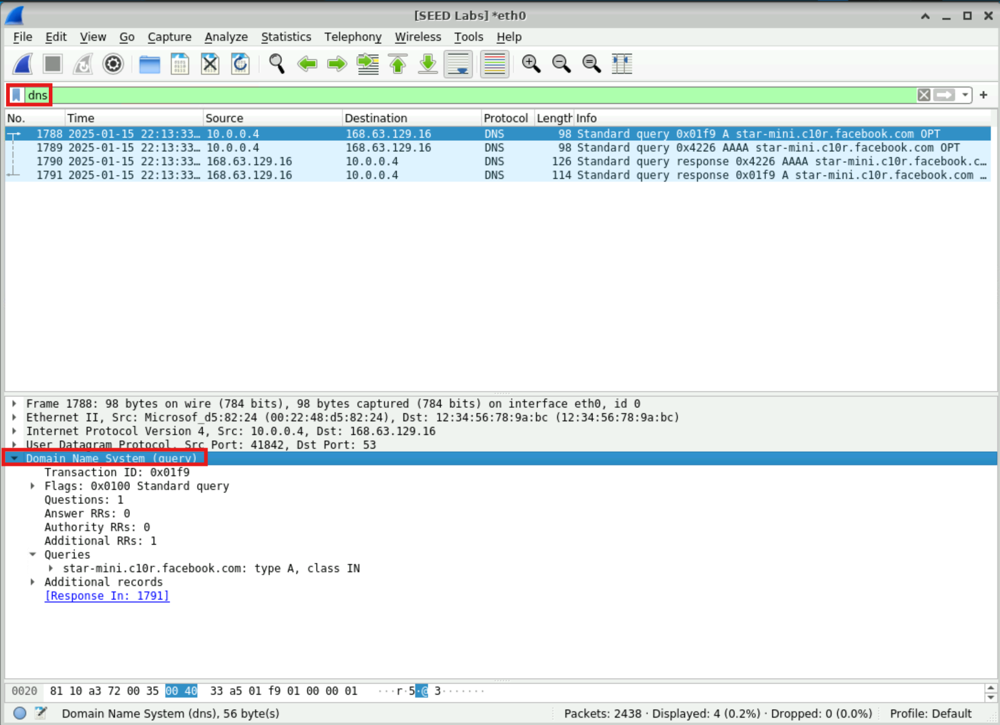
    
  - HTTP Traffic: http

     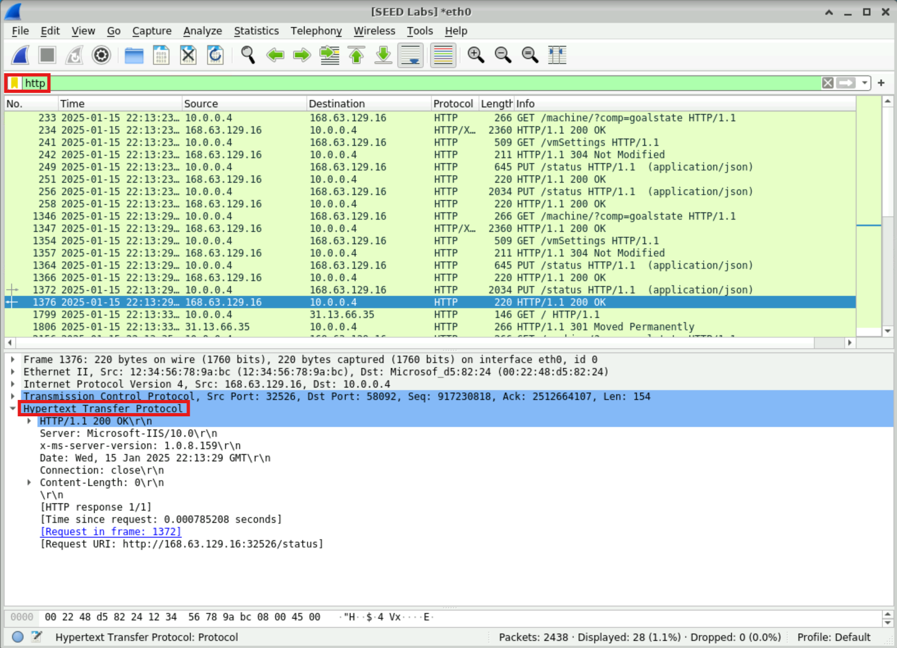
    
- Also, you can filter the packets using the host name: `www.facebook.com` 

      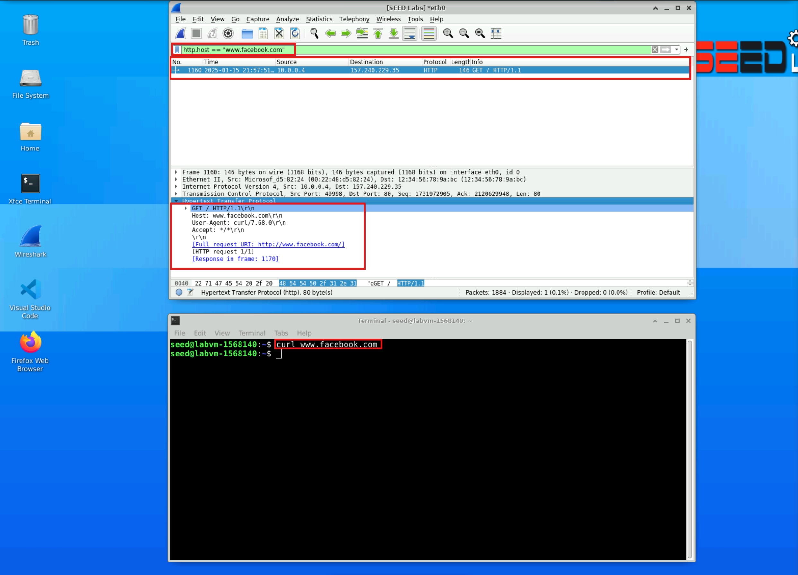


### `nmap`
-  To run `nmap`. We need to run the docker container and test some 
